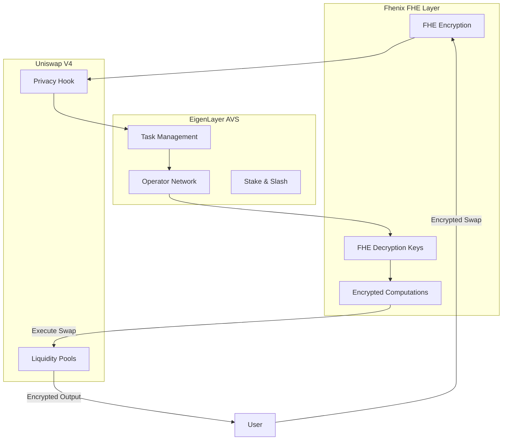
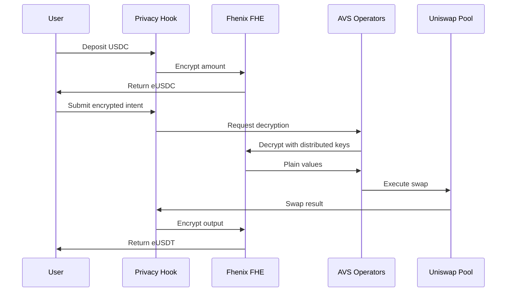

# AlphaEngine Hook - Privacy-Preserving DEX with AVS & Fhenix Integration

**Uniswap Hookathon Demo Repository - September 18th**

A unified repository combining privacy-preserving Uniswap V4 hooks with **EigenLayer AVS** infrastructure and **Fhenix FHE** technology for decentralized encrypted computation.

## 🎯 Project Overview

AlphaEngine Hook integrates three cutting-edge technologies:

### 🔐 Fhenix Integration
- **Fully Homomorphic Encryption (FHE)** enables computations on encrypted data
- Powered by Fhenix's FHE infrastructure for on-chain confidential computation
- All swap amounts remain encrypted throughout the entire process
- Zero-knowledge of trade details until execution

### 🌐 EigenLayer AVS Integration
- **Decentralized operator network** for secure FHE decryption
- Operators stake ETH through EigenLayer for economic security
- Slashing mechanism ensures operator reliability
- Distributed trust model eliminates single points of failure

### 🦄 Uniswap V4 Hook
- **Universal Privacy Hook** transforms any pool into a confidential DEX
- Seamless integration with Uniswap V4's hook architecture
- Single hook serves unlimited token pairs
- Complete MEV resistance through encryption

## ✨ Key Features

- **🔒 Complete Privacy**: Swap amounts encrypted end-to-end using Fhenix FHE
- **🛡️ Decentralized Security**: AVS operators provide distributed decryption
- **⚡ MEV Resistance**: No front-running or sandwich attacks possible
- **🔄 Universal Support**: Works with any ERC20 token pair

## 📁 Repository Structure

```
alphaEngineHook/
├── universal-privacy-hook/    # Privacy-preserving Uniswap V4 hook
│   ├── src/                  # Hook smart contracts
│   ├── test/                 # Test suite
│   └── privateSwap/          # AVS integration specs
│
├── swap-manager-avs/          # EigenLayer AVS for decryption
│   ├── contracts/            # AVS contracts
│   ├── operator/             # Operator implementation
│   └── challenger/           # Slashing mechanism
│
├── frontend/                 # Demo UI (coming soon)
│
└── core.md                   # Core architecture documentation (AI assistant reference)
```

## 🚀 Quick Start

### Prerequisites
- [Foundry](https://book.getfoundry.sh) (forge, cast, anvil)
- [Node.js](https://nodejs.org/) >= 18
- [pnpm](https://pnpm.io/) or npm
- [Rust](https://www.rust-lang.org/) (for AVS operators)

### Local Development

1. **Clone and Setup**
```bash
git clone https://github.com/Nilay27/AlphaEngineHook.git
cd alphaEngineHook

# Install dependencies for both projects
cd universal-privacy-hook && pnpm install && cd ..
cd swap-manager-avs && npm install && cd ..
```

2. **Start Local Blockchain**
```bash
# Terminal 1: Start Anvil
anvil
```

3. **Deploy Contracts**
```bash
# Terminal 2: Deploy EigenLayer & AVS
cd swap-manager-avs
npm run deploy:core
npm run deploy:swap-manager

# Deploy Privacy Hook
cd ../universal-privacy-hook
forge script script/Anvil.s.sol --rpc-url http://localhost:8545 --broadcast
```

4. **Start AVS Operator**
```bash
# Terminal 3: Start operator for FHE decryption
cd swap-manager-avs
npm run start:operator
```

## 🏗️ Integration Architecture

### How Fhenix & AVS Work Together



The integration leverages:
- **Fhenix**: Provides FHE primitives for encryption/decryption
- **AVS Operators**: Distributed network performs decryption securely
- **Economic Security**: EigenLayer staking ensures operator honesty

## 🔐 Universal Privacy Hook

The privacy hook transforms any Uniswap V4 pool into a confidential DEX using Fhenix FHE:

### Key Features
- **Fhenix-Powered Encryption**: All amounts encrypted using Fhenix FHE libraries
- **AVS-Secured Decryption**: Decryption handled by staked operators
- **Universal Support**: Single hook serves unlimited pools
- **Zero MEV**: Encryption prevents all forms of value extraction

### How It Works
1. **Deposit**: Users deposit tokens, receive Fhenix-encrypted representations (eTokens)
2. **Intent Submission**: Submit encrypted swap intents using Fhenix encryption
3. **AVS Processing**: EigenLayer operators decrypt via distributed computation
4. **Execution**: Swaps execute with complete privacy preservation
5. **Withdrawal**: Users receive encrypted output tokens

### Privacy Flow with Fhenix & AVS


[Full Privacy Hook Documentation →](./universal-privacy-hook/README.md)

## 🌐 AVS Integration Details

The EigenLayer AVS provides the decentralized infrastructure for Fhenix FHE operations:

### Components
- **Service Manager**: Coordinates FHE decryption tasks across operators
- **Staked Operators**: Decrypt Fhenix-encrypted intents with economic security
- **Challenger**: Monitors operators, slashes for incorrect decryptions
- **Registry**: Manages operator registration and ETH stakes

### Operator Responsibilities
1. Monitor privacy hook for Fhenix-encrypted swap intents
2. Participate in distributed FHE decryption protocol
3. Execute decrypted swaps on Uniswap V4
4. Submit cryptographic proofs to avoid slashing

### Security Model
- **Economic Security**: Operators stake ETH via EigenLayer
- **Distributed Trust**: Multiple operators required for decryption
- **Slashing Conditions**: Incorrect decryption or non-responsiveness
- **Cryptographic Proofs**: Zero-knowledge proofs of correct execution

[Full AVS Documentation →](./swap-manager-avs/README.md)

## 🔧 Technical Integration Highlights

### Fhenix FHE Features Used
- **euint256**: Encrypted unsigned integers for swap amounts
- **ebool**: Encrypted boolean logic for conditional operations
- **Homomorphic Operations**: Add, subtract, and compare encrypted values
- **Threshold Decryption**: Multi-party computation for secure decryption
- **FHE.sol Library**: Smart contract integration for on-chain FHE

### AVS Infrastructure Components
- **IServiceManager**: Interface for operator task coordination
- **IRegistryCoordinator**: Manages operator registration and stakes
- **IStakeRegistry**: Tracks operator ETH stakes from EigenLayer
- **BLSSignatureChecker**: Verifies operator signatures for tasks
- **Slasher**: Enforces penalties for misbehaving operators

### Integration Points
```solidity
// Fhenix encryption in Privacy Hook
euint256 encryptedAmount = FHE.asEuint256(plainAmount);

// AVS operator decryption request
bytes32 taskHash = serviceManager.createNewTask(
    encryptedAmount,
    block.number + TASK_RESPONSE_WINDOW
);

// Distributed decryption by operators
uint256 decryptedAmount = operators.performThresholdDecryption(
    encryptedAmount,
    operatorSignatures
);
```

## 🧪 Testing

### Privacy Hook Tests
```bash
cd universal-privacy-hook
forge test -vvv

# Key tests:
# - testPoolCreation: Pool initialization with hook
# - testEncryptedIntentSubmission: Submit encrypted swaps
# - testCompletePrivacyFlow: End-to-end privacy flow
```

### AVS Tests
```bash
cd swap-manager-avs
cargo test --workspace

# Integration test
npm run test:integration
```

## 🛠️ Development Roadmap

### Phase 1: Core Implementation ✅
- [x] Privacy hook with FHE integration
- [x] Basic AVS infrastructure
- [x] Local testing environment

### Phase 2: AVS Integration (Current)
- [ ] Connect AVS operators to privacy hook
- [ ] Implement FHE decryption in operators
- [ ] Add slashing for failed decryptions

### Phase 3: Demo UI
- [ ] Frontend for depositing/withdrawing
- [ ] Encrypted swap interface
- [ ] Operator dashboard

### Phase 4: Advanced Features
- [ ] Limit orders with privacy
- [ ] Cross-chain privacy bridge
- [ ] Governance mechanism

## 📚 Documentation

- [Core Architecture](./core.md) - System design, FHE patterns, and AI assistant reference
- [Privacy Hook Specs](./universal-privacy-hook/privateSwap/) - Detailed specifications
- [AVS Integration Plan](./Plan.md) - Roadmap for AVS features
- [Test-Driven Development](./TDD.md) - Testing approach

## 🤖 AI Assistant Integration

The `core.md` file contains comprehensive FHE development patterns and can be used to train AI assistants:

```bash
# For Claude Code
claude "Read the core.md file and help me build FHE smart contracts using these patterns"
```

This enables AI-assisted development of privacy-preserving features with proper FHE implementation.

## 🤝 Contributing

We welcome contributions! Key areas:
- AVS operator improvements
- Frontend development
- Testing and documentation
- Security reviews

## ⚠️ Security

**This is experimental software using cutting-edge cryptography:**
- Not audited for production use
- Use at your own risk on mainnet
- All deposited tokens held by hook contract

## 📝 License

MIT

## 🙏 Acknowledgments

Built for the Uniswap Hookathon with deep integration of:
- **Uniswap V4**: Revolutionary hooks architecture enabling custom pool logic
- **Fhenix**: Industry-leading FHE infrastructure powering on-chain encryption
- **EigenLayer**: AVS framework providing decentralized operator network

### Special Thanks
- Fhenix team for FHE libraries and encryption primitives
- EigenLayer team for restaking and operator coordination
- Uniswap Labs for V4 hooks innovation

---

*Demo Date: September 18th, 2024*  
*Repository: [github.com/Nilay27/AlphaEngineHook](https://github.com/Nilay27/AlphaEngineHook)*