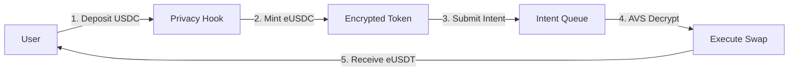

# AlphaEngine Hook - Privacy-Preserving DEX with AVS Integration

**Uniswap Hookathon Demo Repository - September 18th**

A unified repository combining privacy-preserving Uniswap V4 hooks with EigenLayer AVS infrastructure for decentralized FHE decryption.

## 🎯 Project Overview

AlphaEngine Hook combines two key innovations:
1. **Universal Privacy Hook**: Enables completely private swaps on Uniswap V4 using Fully Homomorphic Encryption (FHE)
2. **AVS Infrastructure**: Decentralized operator network for secure FHE decryption and order execution

This integration creates a MEV-resistant, privacy-preserving DEX where:
- Swap amounts remain encrypted until execution
- Decryption is handled by a decentralized operator network
- Front-running and sandwich attacks become impossible
- Privacy is maintained across all operations

## 📁 Repository Structure

```
alphaEngineHook/
├── universal-privacy-hook/    # Privacy-preserving Uniswap V4 hook
│   ├── src/                  # Hook smart contracts
│   ├── test/                 # Test suite
│   └── privateSwap/          # AVS integration specs
│
├── hello-world-avs/          # EigenLayer AVS for decryption
│   ├── contracts/            # AVS contracts
│   ├── operator/             # Operator implementation
│   └── challenger/           # Slashing mechanism
│
├── frontend/                 # Demo UI (coming soon)
│
└── core.md                   # Core architecture documentation (AI assistant reference)
```

## 🚀 Quick Start

### Prerequisites
- [Foundry](https://book.getfoundry.sh) (forge, cast, anvil)
- [Node.js](https://nodejs.org/) >= 18
- [pnpm](https://pnpm.io/) or npm
- [Rust](https://www.rust-lang.org/) (for AVS operators)

### Local Development

1. **Clone and Setup**
```bash
git clone https://github.com/Nilay27/AlphaEngineHook.git
cd alphaEngineHook

# Install dependencies for both projects
cd universal-privacy-hook && pnpm install && cd ..
cd hello-world-avs && npm install && cd ..
```

2. **Start Local Blockchain**
```bash
# Terminal 1: Start Anvil
anvil
```

3. **Deploy Contracts**
```bash
# Terminal 2: Deploy EigenLayer & AVS
cd hello-world-avs
npm run deploy:core
npm run deploy:hello-world

# Deploy Privacy Hook
cd ../universal-privacy-hook
forge script script/Anvil.s.sol --rpc-url http://localhost:8545 --broadcast
```

4. **Start AVS Operator**
```bash
# Terminal 3: Start operator for FHE decryption
cd hello-world-avs
npm run start:operator
```

## 🔐 Universal Privacy Hook

The privacy hook transforms any Uniswap V4 pool into a confidential DEX:

### Key Features
- **Complete Privacy**: Swap amounts encrypted end-to-end using FHE
- **Universal Support**: Single hook serves unlimited pools
- **Zero MEV**: No front-running or sandwich attacks possible
- **Seamless Integration**: Works with any ERC20 token pair

### How It Works
1. Users deposit tokens to receive encrypted token representations (eTokens)
2. Submit encrypted swap intents without revealing amounts
3. AVS operators decrypt and execute swaps asynchronously
4. Users receive encrypted output tokens

### Architecture


[Full Privacy Hook Documentation →](./universal-privacy-hook/README.md)

## 🌐 AVS Integration

The EigenLayer AVS provides decentralized FHE decryption:

### Components
- **Service Manager**: Coordinates operator tasks and slashing
- **Operators**: Decrypt FHE intents and execute swaps
- **Challenger**: Monitors and slashes non-responsive operators
- **Registry**: Manages operator registration and stake

### Operator Flow
1. Monitor privacy hook for encrypted swap intents
2. Decrypt intents using FHE keys
3. Execute swaps on Uniswap V4
4. Submit execution proofs to avoid slashing

[Full AVS Documentation →](./hello-world-avs/README.md)

## 🧪 Testing

### Privacy Hook Tests
```bash
cd universal-privacy-hook
forge test -vvv

# Key tests:
# - testPoolCreation: Pool initialization with hook
# - testEncryptedIntentSubmission: Submit encrypted swaps
# - testCompletePrivacyFlow: End-to-end privacy flow
```

### AVS Tests
```bash
cd hello-world-avs
cargo test --workspace

# Integration test
npm run test:integration
```

## 🛠️ Development Roadmap

### Phase 1: Core Implementation ✅
- [x] Privacy hook with FHE integration
- [x] Basic AVS infrastructure
- [x] Local testing environment

### Phase 2: AVS Integration (Current)
- [ ] Connect AVS operators to privacy hook
- [ ] Implement FHE decryption in operators
- [ ] Add slashing for failed decryptions

### Phase 3: Demo UI
- [ ] Frontend for depositing/withdrawing
- [ ] Encrypted swap interface
- [ ] Operator dashboard

### Phase 4: Advanced Features
- [ ] Limit orders with privacy
- [ ] Cross-chain privacy bridge
- [ ] Governance mechanism

## 📚 Documentation

- [Core Architecture](./core.md) - System design, FHE patterns, and AI assistant reference
- [Privacy Hook Specs](./universal-privacy-hook/privateSwap/) - Detailed specifications
- [AVS Integration Plan](./Plan.md) - Roadmap for AVS features
- [Test-Driven Development](./TDD.md) - Testing approach

## 🤖 AI Assistant Integration

The `core.md` file contains comprehensive FHE development patterns and can be used to train AI assistants:

```bash
# For Claude Code
claude "Read the core.md file and help me build FHE smart contracts using these patterns"
```

This enables AI-assisted development of privacy-preserving features with proper FHE implementation.

## 🤝 Contributing

We welcome contributions! Key areas:
- AVS operator improvements
- Frontend development
- Testing and documentation
- Security reviews

## ⚠️ Security

**This is experimental software using cutting-edge cryptography:**
- Not audited for production use
- Use at your own risk on mainnet
- All deposited tokens held by hook contract

## 📝 License

MIT

## 🙏 Acknowledgments

Built for the Uniswap Hookathon with inspiration from:
- Uniswap V4 team for hooks architecture
- Fhenix team for FHE infrastructure  
- EigenLayer team for AVS framework

---

*Demo Date: September 18th, 2024*  
*Repository: [github.com/Nilay27/AlphaEngineHook](https://github.com/Nilay27/AlphaEngineHook)*