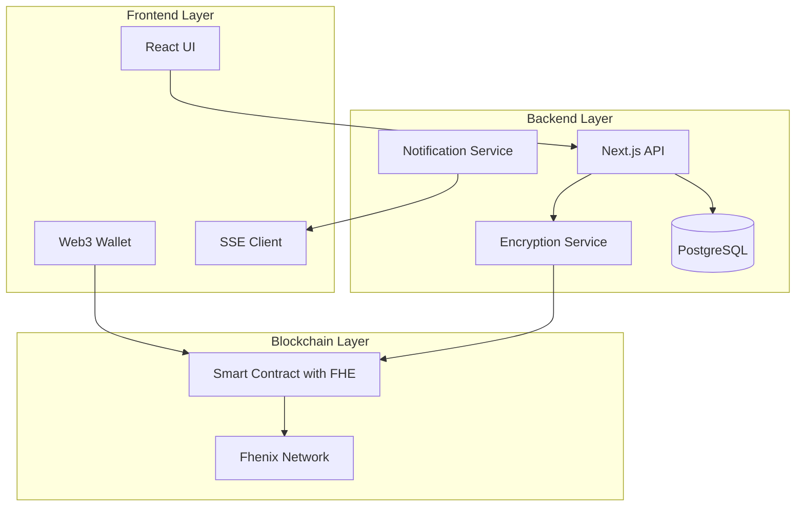
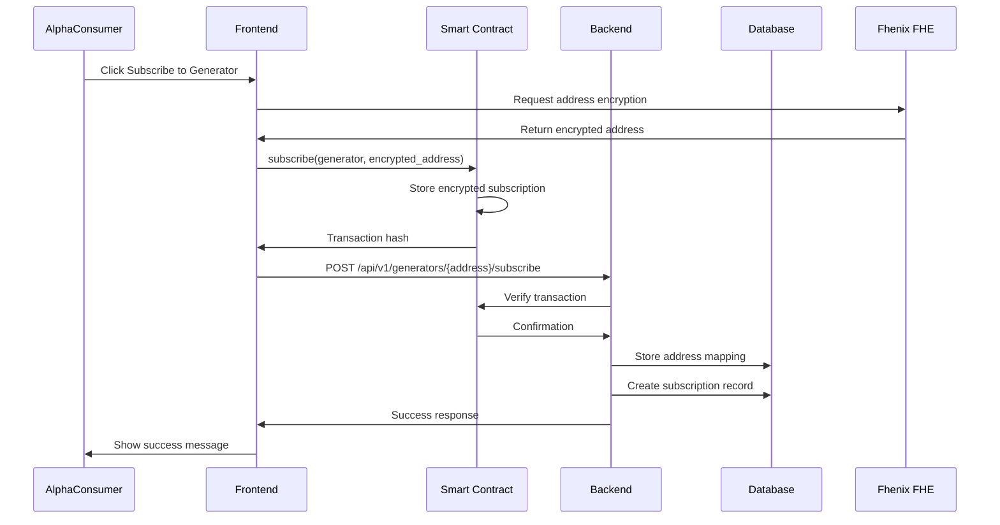
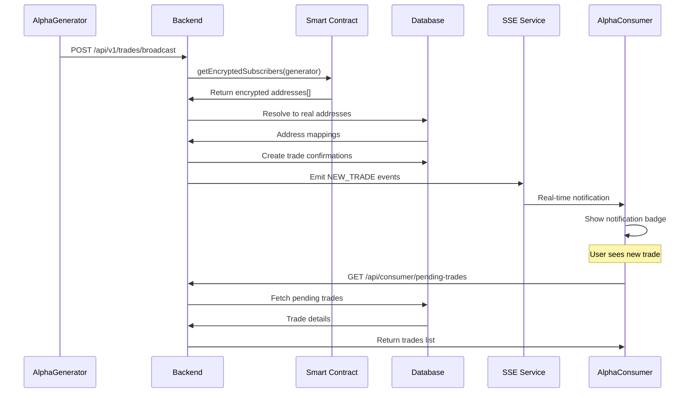
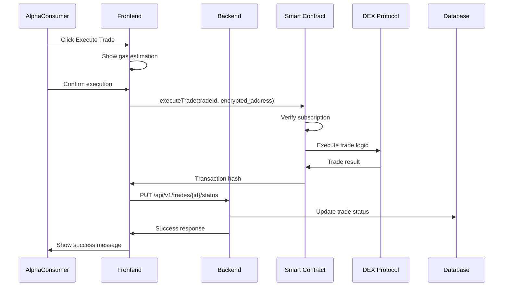
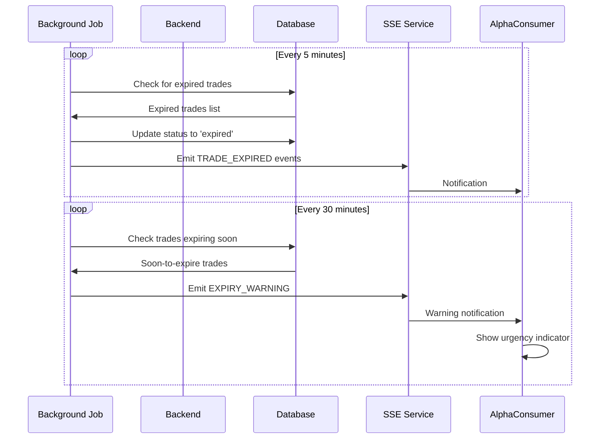

# AlphaEngine Technical Design Document - Subscription System with FHE

**File Created**: 17-September-2025-02:37PM IST
**Version**: 1.0.0
**Status**: DRAFT

## CHANGELOG
- **17-September-2025-02:37PM IST**: Initial creation of comprehensive TDD with Fhenix FHE integration
- **17-September-2025-03:15PM IST**: Fixed critical subscription verification bug by implementing nested mapping structure
- **17-September-2025-04:09PM IST**: Improved code readability by renaming `addresses` to `eaddresses` in getEncryptedSubscribers function for clarity
- **17-September-2025-04:25PM IST**: Removed onlyGenerator modifier from getEncryptedSubscribers function to align with blockchain transparency - encrypted addresses are inherently public
- **17-September-2025-04:30PM IST**: Removed `encryption_params` field from address_mappings table and all related TypeScript/service code - simplified design as encryption metadata not needed
- **17-September-2025-05:45PM IST**: **CRITICAL FIX**: Corrected all FHE/cofhejs implementations - replaced non-existent cofhejs methods with proper fhenixjs API, fixed encryption service to use FhenixClient, updated frontend components, added missing encryptedData storage
- **17-September-2025-06:15PM IST**: **COMPLETE FIX**: Fixed all remaining issues - replaced all cofhejs references with fhenixjs, corrected FhenixClient initialization with provider, removed createInstance method, fixed encrypt method (no encryptionKey parameter), added prepareForContract method, fixed all imports to include sql from drizzle-orm
- **17-September-2025-08:00PM IST**: **PROTOCOL FLEXIBILITY**: Implemented dynamic protocol-specific actions system - replaced fixed enum with flexible string validation, added protocol configuration service, enhanced database schema with protocol metadata, updated API validation to support unlimited protocol actions without smart contract changes

---

## Table of Contents
1. [Executive Summary](#1-executive-summary)
2. [System Architecture Overview](#2-system-architecture-overview)
3. [Smart Contract Specifications](#3-smart-contract-specifications)
4. [Database Design](#4-database-design)
5. [Backend API Architecture](#5-backend-api-architecture)
6. [Frontend Implementation](#6-frontend-implementation)
7. [Sequence Diagrams](#7-sequence-diagrams)
8. [Security & Privacy](#8-security--privacy)
9. [Migration Strategy](#9-migration-strategy)
10. [Testing Strategy](#10-testing-strategy)
11. [Performance Considerations](#11-performance-considerations)
12. [Edge Cases & Error Handling](#12-edge-cases--error-handling)
13. [Deployment Plan](#13-deployment-plan)

---

## 1. Executive Summary

### 1.1 Purpose
Transform AlphaEngine from a **strategy-based subscription model** to an **alphaGenerator-based subscription model** with enhanced privacy through Fhenix FHE (Fully Homomorphic Encryption) for address encryption.

### 1.2 Key Transformations
- **Current**: `AlphaConsumer → Strategy → AlphaGenerator` (indirect)
- **Target**: `AlphaConsumer → AlphaGenerator` (direct with encrypted addresses)

### 1.3 Core Technologies
- **Smart Contracts**: Solidity with Fhenix FHE library
- **Blockchain**: Ethereum/EVM-compatible with FHE support
- **Backend**: Next.js API Routes with TypeScript
- **Database**: PostgreSQL with Drizzle ORM
- **Frontend**: React with Next.js, wagmi for Web3
- **Real-time**: Server-Sent Events (SSE) for notifications

### 1.4 Privacy Features
- Encrypted consumer addresses on-chain using FHE
- Unique encrypted address per subscription
- Backend maintains encryption mapping
- Zero-knowledge subscription verification

---

## 2. System Architecture Overview

### 2.1 High-Level Architecture



### 2.2 Data Flow Architecture

```
┌─────────────────────────────────────────────────────────────┐
│                     AlphaConsumer (αa_1C_1)                 │
│  Real Address: a_1  |  Encrypted: encrypt(a_1, αA_1G_1)    │
└─────────────────────────────────────────────────────────────┘
                                 │
                                 ▼
┌─────────────────────────────────────────────────────────────┐
│                  Smart Contract (with FHE)                   │
│  subscribe(αA_1G_1, encrypted_αa_1C_1)                      │
│  Store: mapping(generator => encrypted_addresses[])          │
└─────────────────────────────────────────────────────────────┘
                                 │
                                 ▼
┌─────────────────────────────────────────────────────────────┐
│                     Backend Mapping Service                  │
│  address_mappings table:                                     │
│  - real_address: a_1                                        │
│  - encrypted_address: encrypted_a_1                         │
│  - generator_address: αA_1G_1                               │
└─────────────────────────────────────────────────────────────┘
```

---

## 3. Smart Contract Specifications

### 3.1 AlphaEngineSubscription.sol

```solidity
// SPDX-License-Identifier: MIT
pragma solidity ^0.8.20;

import "@fhenixprotocol/cofhe-contracts/FHE.sol";
import "@openzeppelin/contracts/access/Ownable.sol";
import "@openzeppelin/contracts/security/ReentrancyGuard.sol";
import "@openzeppelin/contracts/security/Pausable.sol";

/**
 * @title AlphaEngineSubscription
 * @dev Manages encrypted subscriptions between AlphaConsumers and AlphaGenerators
 */
contract AlphaEngineSubscription is Ownable, ReentrancyGuard, Pausable {
    using FHE for *;

    // ============ State Variables ============

    struct Generator {
        address generatorAddress;
        uint256 subscriptionFee;
        uint256 performanceFee; // Percentage in basis points (100 = 1%) TODO:MAYBE For simplicity - keep it to be 0% for now or even remove it
        bool isActive;
        uint256 totalSubscribers;
        uint256 totalVolume;
    }

    struct EncryptedSubscription {
        eaddress encryptedConsumerAddress; // FHE encrypted address
        euint256 subscribedAt; // FHE encrypted timestamp
        ebool isActive; // FHE encrypted active status
        euint256 subscriptionFee; // FHE encrypted fee paid
    }

    struct TradeExecution {
        bytes32 tradeId;
        address generator;
        bytes executionData; // Encrypted trade parameters
        uint256 gasEstimate;
        uint256 expiryTime;
        bool executed;
    }

    // Mappings
    mapping(address => Generator) public generators;
    mapping(address => EncryptedSubscription[]) private generatorSubscriptions;
    // Direct mapping: generator -> encrypted consumer -> subscription status
    mapping(address => mapping(eaddress => ebool)) private generatorToConsumerActive;
    mapping(bytes32 => TradeExecution) public trades;

    // Events
    event GeneratorRegistered(address indexed generator, uint256 subscriptionFee);
    event SubscriptionCreated(
        address indexed generator,
        eaddress encryptedSubscriber,  // FHE encrypted address (non-indexed)
        uint256 timestamp
    );
    event TradeProposed(
        bytes32 indexed tradeId,
        address indexed generator,
        uint256 expiryTime
    );
    event TradeExecuted(
        bytes32 indexed tradeId,
        address indexed executor,
        bool success
    );
    event SubscriptionCancelled(
        address indexed generator,
        eaddress encryptedSubscriber,  // FHE encrypted address (non-indexed)
        uint256 timestamp
    );

    // ============ Modifiers ============

    modifier onlyGenerator() {
        require(generators[msg.sender].isActive, "Not an active generator");
        _;
    }

    modifier validAddress(address _addr) {
        require(_addr != address(0), "Invalid address");
        _;
    }

    // ============ Core Functions ============

    /**
     * @dev Register as an AlphaGenerator
     * @param _subscriptionFee Fee in wei for subscriptions
     * @param _performanceFee Performance fee in basis points
     */
    function registerGenerator(
        uint256 _subscriptionFee,
        uint256 _performanceFee
    ) external validAddress(msg.sender) {
        require(_performanceFee <= 3000, "Performance fee too high"); // Max 30%

        generators[msg.sender] = Generator({
            generatorAddress: msg.sender,
            subscriptionFee: _subscriptionFee,
            performanceFee: _performanceFee,
            isActive: true,
            totalSubscribers: 0,
            totalVolume: 0
        });

        emit GeneratorRegistered(msg.sender, _subscriptionFee);
    }

    /**
     * @dev Subscribe to an AlphaGenerator with encrypted address
     * @param _generator The generator to subscribe to
     * @param _encryptedAddress FHE encrypted consumer address
     */
    function subscribe(
        address _generator,
        eaddress _encryptedAddress
    ) external payable nonReentrant {
        Generator storage gen = generators[_generator];
        require(gen.isActive, "Generator not active");
        require(msg.value >= gen.subscriptionFee, "Insufficient payment");

        // Check if already subscribed
        require(
            !FHE.decrypt(generatorToConsumerActive[_generator][_encryptedAddress]),
            "Already subscribed"
        );

        // Create encrypted subscription
        EncryptedSubscription memory newSub = EncryptedSubscription({
            encryptedConsumerAddress: _encryptedAddress,
            subscribedAt: FHE.asEuint256(block.timestamp),
            isActive: FHE.asEbool(true),
            subscriptionFee: FHE.asEuint256(msg.value)
        });

        // Store subscription in array
        generatorSubscriptions[_generator].push(newSub);

        // Mark as active subscriber in nested mapping
        generatorToConsumerActive[_generator][_encryptedAddress] = FHE.asEbool(true);

        // Update generator stats
        gen.totalSubscribers++;

        // Transfer fee to generator
        payable(_generator).transfer(msg.value);

        emit SubscriptionCreated(_generator, _encryptedAddress, block.timestamp);
    }

    /**
     * @dev Get encrypted subscribers for a generator
     * @param _generator Generator address
     * @return Array of encrypted addresses
     *
     * NOTE: This function is public because encrypted addresses are already
     * visible on-chain through transaction calldata. The security model
     * protects the DECRYPTION capability, not the encrypted values themselves.
     */
    function getEncryptedSubscribers(
        address _generator
    ) external view returns (eaddress[] memory) {
        EncryptedSubscription[] memory subs = generatorSubscriptions[_generator];

        // Count active subscriptions first
        uint256 activeCount = 0;
        for (uint256 i = 0; i < subs.length; i++) {
            if (FHE.decrypt(subs[i].isActive)) {
                activeCount++;
            }
        }

        // Create properly sized array
        eaddress[] memory eaddresses = new eaddress[](activeCount);
        uint256 currentIndex = 0;

        // Fill array with only active subscriptions
        for (uint256 i = 0; i < subs.length; i++) {
            if (FHE.decrypt(subs[i].isActive)) {
                eaddresses[currentIndex++] = subs[i].encryptedConsumerAddress;
            }
        }

        return eaddresses;
    }

    /**
     * @dev Propose a trade for execution by subscribers
     * @param _executionData Encrypted trade parameters
     * @param _gasEstimate Estimated gas for execution
     * @param _expiryMinutes Minutes until trade expires
     */
    function proposeTrade(
        bytes calldata _executionData,
        uint256 _gasEstimate,
        uint256 _expiryMinutes
    ) external onlyGenerator returns (bytes32) {
        require(_expiryMinutes > 0 && _expiryMinutes <= 1440, "Invalid expiry");

        bytes32 tradeId = keccak256(
            abi.encodePacked(msg.sender, _executionData, block.timestamp)
        );

        trades[tradeId] = TradeExecution({
            tradeId: tradeId,
            generator: msg.sender,
            executionData: _executionData,
            gasEstimate: _gasEstimate,
            expiryTime: block.timestamp + (_expiryMinutes * 60),
            executed: false
        });

        emit TradeProposed(tradeId, msg.sender, trades[tradeId].expiryTime);

        return tradeId;
    }

    /**
     * @dev Execute a proposed trade
     * @param _tradeId The trade to execute
     * @param _encryptedExecutor Encrypted address of executor
     */
    function executeTrade(
        bytes32 _tradeId,
        eaddress _encryptedExecutor
    ) external nonReentrant {
        TradeExecution storage trade = trades[_tradeId];
        require(trade.generator != address(0), "Trade not found");
        require(!trade.executed, "Already executed");
        require(block.timestamp <= trade.expiryTime, "Trade expired");

        // Verify executor is subscribed using direct mapping lookup
        require(
            FHE.decrypt(generatorToConsumerActive[trade.generator][_encryptedExecutor]),
            "Not subscribed"
        );

        trade.executed = true;

        // Execute trade logic (simplified - would integrate with DEX)
        bool success = _executeTradeLogic(trade.executionData);

        emit TradeExecuted(_tradeId, msg.sender, success);
    }

    /**
     * @dev Unsubscribe from an AlphaGenerator
     * @param _generator The generator to unsubscribe from
     * @param _encryptedAddress Encrypted address of the subscriber
     */
    function unsubscribe(
        address _generator,
        eaddress _encryptedAddress
    ) external {
        // Verify the caller is subscribed
        require(
            FHE.decrypt(generatorToConsumerActive[_generator][_encryptedAddress]),
            "Not subscribed"
        );

        // Mark as inactive in mapping
        generatorToConsumerActive[_generator][_encryptedAddress] = FHE.asEbool(false);

        // Update subscription status in array (for consistency)
        EncryptedSubscription[] storage subs = generatorSubscriptions[_generator];
        for (uint256 i = 0; i < subs.length; i++) {
            if (FHE.eq(subs[i].encryptedConsumerAddress, _encryptedAddress)) {
                subs[i].isActive = FHE.asEbool(false);
                break;
            }
        }

        // Update generator stats
        generators[_generator].totalSubscribers--;

        emit SubscriptionCancelled(_generator, _encryptedAddress, block.timestamp);
    }

    /**
     * @dev Check if an encrypted address is subscribed to a generator
     * @param _generator Generator address
     * @param _encryptedAddress Encrypted consumer address
     * @return Whether the address is actively subscribed
     */
    function isSubscribed(
        address _generator,
        eaddress _encryptedAddress
    ) external view returns (bool) {
        return FHE.decrypt(generatorToConsumerActive[_generator][_encryptedAddress]);
    }

    /**
     * @dev Internal trade execution logic
     */
    function _executeTradeLogic(
        bytes memory _executionData
    ) private returns (bool) {
        // TODO: @nilay needs to integrate the trade logic here Integrate with DEX protocols (Uniswap, 1inch, etc.)
        // This is a placeholder for actual implementation
        return true;
    }

    // ============ Admin Functions ============

    function pause() external onlyOwner {
        _pause();
    }

    function unpause() external onlyOwner {
        _unpause();
    }

    /**
     * @dev Emergency withdrawal
     */
    function emergencyWithdraw() external onlyOwner {
        payable(owner()).transfer(address(this).balance);
    }
}
```

### 3.2 FHE Helper Library

```solidity
// SPDX-License-Identifier: MIT
pragma solidity ^0.8.20;

import "@fhenixprotocol/cofhe-contracts/FHE.sol";

/**
 * @title FHEAddressEncryption
 * @dev Helper library for address encryption operations
 */
library FHEAddressEncryption {
    using FHE for *;

    /**
     * @dev Encrypt an address with generator-specific key
     * @param _address Address to encrypt
     * @param _generator Generator address (used as part of encryption key)
     * @return Encrypted address
     */
    function encryptAddress(
        address _address,
        address _generator
    ) internal pure returns (eaddress) {
        // Create unique encryption key based on generator
        bytes32 key = keccak256(abi.encodePacked(_generator, _address));

        // Use FHE to encrypt the address
        return FHE.asEaddress(_address);
    }

    /**
     * @dev Compare two encrypted addresses
     * @param _a First encrypted address
     * @param _b Second encrypted address
     * @return Whether addresses are equal
     */
    function compareEncrypted(
        eaddress _a,
        eaddress _b
    ) internal pure returns (ebool) {
        return FHE.eq(_a, _b);
    }

    /**
     * @dev Verify subscription status using generator mapping
     * @param _generator Generator address
     * @param _encrypted Encrypted consumer address
     * @return Whether subscription is valid
     */
    function verifySubscription(
        address _generator,
        eaddress _encrypted
    ) internal view returns (bool) {
        // Direct lookup in the nested mapping
        // This would be called from the main contract
        return true; // Placeholder - actual implementation in main contract
    }
}
```

---

## 4. Database Design

### 4.1 Schema Modifications

#### 4.1.1 New Table: `address_mappings`

```sql
CREATE TABLE address_mappings (
    mapping_id UUID PRIMARY KEY DEFAULT gen_random_uuid(),
    real_address VARCHAR(42) NOT NULL,
    encrypted_address TEXT NOT NULL UNIQUE,
    encrypted_data TEXT NOT NULL,  -- Stores full encrypted FHE data
    alpha_generator_address VARCHAR(42) NOT NULL,
    subscription_id UUID REFERENCES subscriptions(subscription_id),
    created_at TIMESTAMP WITH TIME ZONE DEFAULT NOW(),
    updated_at TIMESTAMP WITH TIME ZONE DEFAULT NOW(),

    -- Indexes for performance
    INDEX idx_address_mappings_real (real_address),
    INDEX idx_address_mappings_encrypted (encrypted_address),
    INDEX idx_address_mappings_generator (alpha_generator_address),
    INDEX idx_address_mappings_subscription (subscription_id),

    -- Composite index for lookup
    INDEX idx_address_mapping_lookup (real_address, alpha_generator_address),

    -- Constraints
    UNIQUE KEY unique_subscription_mapping (real_address, alpha_generator_address),
    CHECK (real_address ~ '^0x[a-fA-F0-9]{40}$'),
    CHECK (alpha_generator_address ~ '^0x[a-fA-F0-9]{40}$')
);

-- Trigger for updated_at
CREATE TRIGGER update_address_mappings_updated_at
    BEFORE UPDATE ON address_mappings
    FOR EACH ROW
    EXECUTE FUNCTION update_updated_at_column();
```

#### 4.1.2 Modified: `subscriptions` Table

```sql
ALTER TABLE subscriptions
    ADD COLUMN alpha_generator_address VARCHAR(42),
    ADD COLUMN encrypted_consumer_address TEXT,
    ADD COLUMN subscription_type VARCHAR(20) DEFAULT 'generator'
        CHECK (subscription_type IN ('strategy', 'generator')),
    ADD COLUMN encryption_version INTEGER DEFAULT 1,
    ADD COLUMN metadata JSONB DEFAULT '{}';

-- Add indexes
CREATE INDEX idx_subscriptions_generator ON subscriptions(alpha_generator_address);
CREATE INDEX idx_subscriptions_type ON subscriptions(subscription_type);
CREATE INDEX idx_subscriptions_encrypted ON subscriptions(encrypted_consumer_address);

-- Add foreign key to address_mappings
ALTER TABLE subscriptions
    ADD CONSTRAINT fk_subscription_mapping
    FOREIGN KEY (encrypted_consumer_address)
    REFERENCES address_mappings(encrypted_address);
```

#### 4.1.3 Enhanced: `trade_confirmations` Table

```sql
ALTER TABLE trade_confirmations
    ADD COLUMN trade_status VARCHAR(20) DEFAULT 'pending'
        CHECK (trade_status IN ('pending', 'executed', 'rejected', 'expired')),
    ADD COLUMN expiry_timestamp TIMESTAMP WITH TIME ZONE,
    ADD COLUMN rejection_reason TEXT,
    ADD COLUMN alpha_generator_address VARCHAR(42),
    ADD COLUMN encrypted_consumer_address TEXT,
    ADD COLUMN protocol VARCHAR(50) NOT NULL DEFAULT 'uniswap',
    ADD COLUMN action_type VARCHAR(50) NOT NULL DEFAULT 'swap',
    ADD COLUMN protocol_metadata JSONB DEFAULT '{}',
    ADD COLUMN encoded_execution_data TEXT,
    ADD COLUMN gas_multiplier DECIMAL(3,2) DEFAULT 1.0,
    ADD COLUMN notification_sent BOOLEAN DEFAULT FALSE,
    ADD COLUMN execution_result JSONB,
    ADD COLUMN gas_used VARCHAR(20),
    ADD COLUMN performance_fee VARCHAR(20);

-- Add indexes
CREATE INDEX idx_trade_confirmations_status ON trade_confirmations(trade_status);
CREATE INDEX idx_trade_confirmations_expiry ON trade_confirmations(expiry_timestamp);
CREATE INDEX idx_trade_confirmations_generator ON trade_confirmations(alpha_generator_address);
CREATE INDEX idx_trade_confirmations_encrypted ON trade_confirmations(encrypted_consumer_address);
CREATE INDEX idx_trade_protocol_action ON trade_confirmations(protocol, action_type);
CREATE INDEX idx_trade_protocol ON trade_confirmations(protocol);
CREATE INDEX idx_trade_confirmations_notification ON trade_confirmations(notification_sent)
    WHERE notification_sent = FALSE;

-- Partial index for pending trades
CREATE INDEX idx_pending_trades ON trade_confirmations(alpha_consumer_address, created_at DESC)
    WHERE trade_status = 'pending';
```

#### 4.1.4 New Table: `alpha_generators`

```sql
CREATE TABLE alpha_generators (
    generator_id UUID PRIMARY KEY DEFAULT gen_random_uuid(),
    wallet_address VARCHAR(42) NOT NULL UNIQUE,
    display_name VARCHAR(100),
    description TEXT,
    subscription_fee VARCHAR(20) NOT NULL,
    performance_fee INTEGER DEFAULT 0 CHECK (performance_fee >= 0 AND performance_fee <= 3000),
    total_subscribers INTEGER DEFAULT 0,
    total_volume NUMERIC(78, 0) DEFAULT 0,
    rating DECIMAL(3, 2) DEFAULT 0.00,
    is_verified BOOLEAN DEFAULT FALSE,
    is_active BOOLEAN DEFAULT TRUE,
    metadata JSONB DEFAULT '{}',
    created_at TIMESTAMP WITH TIME ZONE DEFAULT NOW(),
    updated_at TIMESTAMP WITH TIME ZONE DEFAULT NOW(),

    -- Indexes
    INDEX idx_generators_wallet (wallet_address),
    INDEX idx_generators_active (is_active),
    INDEX idx_generators_rating (rating DESC),

    -- Constraints
    CHECK (wallet_address ~ '^0x[a-fA-F0-9]{40}$')
);
```

### 4.2 TypeScript Types (Drizzle ORM)

```typescript
// db/schema/address-mappings-schema.ts
import { pgTable, uuid, text, varchar, jsonb, timestamp, index, uniqueIndex } from "drizzle-orm/pg-core";
import { sql } from "drizzle-orm";

export const addressMappingsTable = pgTable("address_mappings", {
  mappingId: uuid("mapping_id").primaryKey().default(sql`gen_random_uuid()`),
  realAddress: varchar("real_address", { length: 42 }).notNull(),
  encryptedAddress: text("encrypted_address").notNull().unique(),
  encryptedData: text("encrypted_data").notNull(),  // Stores full encrypted FHE data
  alphaGeneratorAddress: varchar("alpha_generator_address", { length: 42 }).notNull(),
  subscriptionId: uuid("subscription_id"),  // Optional reference to subscriptions table
  createdAt: timestamp("created_at", { withTimezone: true }).default(sql`now()`).notNull(),
  updatedAt: timestamp("updated_at", { withTimezone: true }).default(sql`now()`).notNull(),
}, (table) => {
  return {
    realAddressIdx: index("idx_address_mappings_real").on(table.realAddress),
    encryptedAddressIdx: index("idx_address_mappings_encrypted").on(table.encryptedAddress),
    generatorIdx: index("idx_address_mappings_generator").on(table.alphaGeneratorAddress),
    subscriptionIdx: index("idx_address_mappings_subscription").on(table.subscriptionId),
    lookupIdx: index("idx_address_mapping_lookup").on(table.realAddress, table.alphaGeneratorAddress),
    uniqueMapping: uniqueIndex("unique_subscription_mapping").on(table.realAddress, table.alphaGeneratorAddress),
  }
});

export type AddressMapping = typeof addressMappingsTable.$inferSelect;
export type NewAddressMapping = typeof addressMappingsTable.$inferInsert;
```

---

## 5. Backend API Architecture

### 5.1 Core Services

#### 5.1.1 Encryption Service

```typescript
// backend/src/services/encryption.service.ts

import { ethers } from 'ethers';
import { FhenixClient } from 'fhenixjs';
import { db } from '@/db/db';
import { addressMappingsTable } from '@/db/schema';
import { eq, and, sql } from 'drizzle-orm';

export class FHEEncryptionService {
  private fhenixClient: FhenixClient;
  private provider: ethers.Provider;
  private initialized = false;

  constructor() {
    this.provider = new ethers.JsonRpcProvider(process.env.FHENIX_NETWORK_URL);
    this.initializeFHE();
  }

  private async initializeFHE() {
    if (this.initialized) return;

    // Initialize Fhenix client with provider
    this.fhenixClient = new FhenixClient({
      provider: this.provider
    });

    this.initialized = true;
  }

  /**
   * Encrypt an address for a specific generator
   */
  async encryptAddress(
    realAddress: string,
    generatorAddress: string
  ): Promise<{
    encryptedAddress: string;
    encryptedData: any;
  }> {
    await this.initializeFHE();

    // Validate addresses
    if (!ethers.isAddress(realAddress) || !ethers.isAddress(generatorAddress)) {
      throw new Error('Invalid address format');
    }

    // Check for existing mapping
    const existing = await db
      .select()
      .from(addressMappingsTable)
      .where(
        and(
          eq(addressMappingsTable.realAddress, realAddress),
          eq(addressMappingsTable.alphaGeneratorAddress, generatorAddress)
        )
      )
      .limit(1);

    if (existing.length > 0) {
      return {
        encryptedAddress: existing[0].encryptedAddress,
        encryptedData: JSON.parse(existing[0].encryptedData || '{}')
      };
    }

    // Encrypt using Fhenix client - no encryption key parameter
    const encrypted = await this.fhenixClient.encrypt(
      realAddress,
      'address'
    );

    // Generate identifier for database storage (not for encryption)
    const encryptedIdentifier = ethers.keccak256(
      ethers.solidityPacked(
        ['address', 'address', 'bytes'],
        [generatorAddress, realAddress, ethers.toUtf8Bytes('FHE_V1')]
      )
    );

    // Store mapping in database
    const [mapping] = await db
      .insert(addressMappingsTable)
      .values({
        realAddress,
        encryptedAddress: encryptedIdentifier,
        encryptedData: JSON.stringify(encrypted),
        alphaGeneratorAddress: generatorAddress,
      })
      .returning();

    return {
      encryptedAddress: mapping.encryptedAddress,
      encryptedData: encrypted
    };
  }

  /**
   * Resolve encrypted addresses to real addresses
   */
  async resolveEncryptedAddresses(
    encryptedAddresses: string[]
  ): Promise<Map<string, string>> {
    const mappings = await db
      .select()
      .from(addressMappingsTable)
      .where(sql`${addressMappingsTable.encryptedAddress} = ANY(${encryptedAddresses})`);

    const addressMap = new Map<string, string>();
    for (const mapping of mappings) {
      addressMap.set(mapping.encryptedAddress, mapping.realAddress);
    }

    return addressMap;
  }

  /**
   * Decrypt address (internal use only)
   */
  async decryptAddress(
    encryptedAddress: string,
    generatorAddress: string
  ): Promise<string | null> {
    const [mapping] = await db
      .select()
      .from(addressMappingsTable)
      .where(
        and(
          eq(addressMappingsTable.encryptedAddress, encryptedAddress),
          eq(addressMappingsTable.alphaGeneratorAddress, generatorAddress)
        )
      )
      .limit(1);

    return mapping?.realAddress || null;
  }

  /**
   * Prepare encrypted data for smart contract call
   */
  async prepareForContract(encryptedData: any): Promise<{
    data: string;
    proof: string;
  }> {
    if (typeof encryptedData === 'string') {
      encryptedData = JSON.parse(encryptedData);
    }

    return {
      data: encryptedData.data || encryptedData.ciphertext,
      proof: encryptedData.proof || '0x'
    };
  }
}

export const encryptionService = new FHEEncryptionService();
```

#### 5.1.2 Trade Lifecycle Service

```typescript
// backend/src/services/trade-lifecycle.service.ts

import { db } from '@/db/db';
import { tradeConfirmationsTable } from '@/db/schema';
import { eq, lt, and, isNull, sql } from 'drizzle-orm';
import { EventEmitter } from 'events';
import { ethers } from 'ethers';
import { encryptionService } from './encryption.service';
import { AlphaEngineABI } from '@/contracts/AlphaEngineABI';

export enum TradeStatus {
  PENDING = 'pending',
  EXECUTED = 'executed',
  REJECTED = 'rejected',
  EXPIRED = 'expired',
}

export class TradeLifecycleService extends EventEmitter {
  private expiryCheckInterval: NodeJS.Timeout | null = null;

  constructor() {
    super();
    this.startExpiryMonitor();
  }

  /**
   * Create trade confirmations for all subscribers
   */
  async broadcastTrade(params: {
    alphaGeneratorAddress: string;
    executionParams: any;
    encodedExecutionData?: string; // Optional, will be generated if not provided
    gasEstimate: string;
    expiryMinutes: number;
  }) {
    const {
      alphaGeneratorAddress,
      executionParams,
      encodedExecutionData,
      gasEstimate,
      expiryMinutes
    } = params;

    // Import protocol utilities
    const { getActionConfig } = await import('@/lib/protocols/action-mappings');
    const { ProtocolConfigService } = await import('@/services/protocol-config.service');

    // Get action config for gas adjustment
    const actionConfig = getActionConfig(
      executionParams.protocol || 'uniswap',
      executionParams.action || 'swap'
    );

    // Apply gas multiplier if specified
    const adjustedGasEstimate = actionConfig?.gasMultiplier
      ? (BigInt(gasEstimate) * BigInt(Math.floor(actionConfig.gasMultiplier * 100)) / 100n).toString()
      : gasEstimate;

    // Generate encoded data if not provided
    const finalEncodedData = encodedExecutionData || ProtocolConfigService.encodeExecutionData({
      protocol: executionParams.protocol || 'uniswap',
      action: executionParams.action || 'swap',
      params: executionParams,
    });

    // Get encrypted subscribers from blockchain
    const subscriberAddresses = await this.getEncryptedSubscribers(alphaGeneratorAddress);

    // Resolve to real addresses
    const addressMap = await encryptionService.resolveEncryptedAddresses(subscriberAddresses);

    // Create trade confirmations
    const trades = [];
    const expiryTime = new Date(Date.now() + expiryMinutes * 60 * 1000);

    for (const [encrypted, real] of addressMap.entries()) {
      const [trade] = await db
        .insert(tradeConfirmationsTable)
        .values({
          alphaGeneratorAddress,
          alphaConsumerAddress: real,
          encryptedConsumerAddress: encrypted,
          executionParams,
          encodedExecutionData: finalEncodedData,
          protocol: executionParams.protocol || 'uniswap',
          actionType: executionParams.action || 'swap',
          protocolMetadata: {
            displayName: actionConfig?.displayName,
            icon: actionConfig?.icon,
            requiresApproval: actionConfig?.requiresApproval,
            description: actionConfig?.description,
          },
          gasEstimate: adjustedGasEstimate,
          gasMultiplier: actionConfig?.gasMultiplier || 1.0,
          tradeStatus: TradeStatus.PENDING,
          expiryTimestamp: expiryTime,
          notificationSent: false,
        })
        .returning();

      trades.push(trade);

      // Emit event for real-time notification
      this.emit('tradeCreated', trade);
    }

    return trades;
  }

  /**
   * Update trade status
   */
  async updateTradeStatus(
    confirmationId: string,
    status: TradeStatus,
    additionalData?: {
      executionTxHash?: string;
      rejectionReason?: string;
      gasUsed?: string;
    }
  ) {
    const [updated] = await db
      .update(tradeConfirmationsTable)
      .set({
        tradeStatus: status,
        ...additionalData,
        updatedAt: new Date(),
      })
      .where(eq(tradeConfirmationsTable.confirmationId, confirmationId))
      .returning();

    // Emit status change event
    this.emit('tradeStatusChanged', updated);

    return updated;
  }

  /**
   * Monitor and expire trades
   */
  private startExpiryMonitor() {
    // Check every 5 minutes
    this.expiryCheckInterval = setInterval(async () => {
      const expiredTrades = await db
        .update(tradeConfirmationsTable)
        .set({
          tradeStatus: TradeStatus.EXPIRED,
          updatedAt: new Date(),
        })
        .where(
          and(
            eq(tradeConfirmationsTable.tradeStatus, TradeStatus.PENDING),
            lt(tradeConfirmationsTable.expiryTimestamp, new Date())
          )
        )
        .returning();

      // Emit expiry events
      for (const trade of expiredTrades) {
        this.emit('tradeExpired', trade);
      }
    }, 5 * 60 * 1000);
  }

  /**
   * Get encrypted subscribers from blockchain
   * NOTE: This is a public view function - no special permissions needed
   * as encrypted addresses are already visible in transaction history
   */
  private async getEncryptedSubscribers(generatorAddress: string): Promise<string[]> {
    // Call smart contract to get encrypted addresses
    // No signer needed - this is public information
    const provider = new ethers.JsonRpcProvider(process.env.BLOCKCHAIN_RPC_URL);
    const contract = new ethers.Contract(
      process.env.ALPHAENGINE_CONTRACT_ADDRESS!,
      AlphaEngineABI,
      provider
    );

    const encryptedAddresses = await contract.getEncryptedSubscribers(generatorAddress);
    return encryptedAddresses;
  }

  /**
   * Send expiry warning notifications
   */
  async sendExpiryWarnings() {
    const oneHourFromNow = new Date(Date.now() + 60 * 60 * 1000);

    const soonToExpire = await db
      .select()
      .from(tradeConfirmationsTable)
      .where(
        and(
          eq(tradeConfirmationsTable.tradeStatus, TradeStatus.PENDING),
          lt(tradeConfirmationsTable.expiryTimestamp, oneHourFromNow),
          eq(tradeConfirmationsTable.notificationSent, false)
        )
      );

    for (const trade of soonToExpire) {
      this.emit('expiryWarning', trade);

      // Mark notification as sent
      await db
        .update(tradeConfirmationsTable)
        .set({ notificationSent: true })
        .where(eq(tradeConfirmationsTable.confirmationId, trade.confirmationId));
    }
  }

  cleanup() {
    if (this.expiryCheckInterval) {
      clearInterval(this.expiryCheckInterval);
    }
  }
}

export const tradeLifecycleService = new TradeLifecycleService();
```

### 5.1.3 Protocol Configuration Service

```typescript
// backend/src/services/protocol-config.service.ts

import { ethers } from 'ethers';

export class ProtocolConfigService {
  /**
   * Encode execution parameters for smart contract
   * The smart contract receives this as bytes and doesn't need to understand it
   */
  static encodeExecutionData(params: {
    protocol: string;
    action: string;
    params: any;
  }): string {
    // Create a structured encoding that can be decoded later
    const encoded = ethers.AbiCoder.defaultAbiCoder().encode(
      ['string', 'string', 'bytes'],
      [
        params.protocol,
        params.action,
        ethers.AbiCoder.defaultAbiCoder().encode(
          ['address', 'address', 'uint256', 'uint256', 'bytes'],
          [
            params.params.tokenIn || ethers.ZeroAddress,
            params.params.tokenOut || ethers.ZeroAddress,
            ethers.parseEther(params.params.amount || '0'),
            params.params.slippage || 50, // 0.5% default
            ethers.toUtf8Bytes(JSON.stringify(params.params.data || {}))
          ]
        )
      ]
    );

    return encoded;
  }

  /**
   * Decode execution data from smart contract
   */
  static decodeExecutionData(encodedData: string): {
    protocol: string;
    action: string;
    tokenIn: string;
    tokenOut: string;
    amount: string;
    slippage: number;
    data: any;
  } {
    const [protocol, action, paramsBytes] = ethers.AbiCoder.defaultAbiCoder().decode(
      ['string', 'string', 'bytes'],
      encodedData
    );

    const [tokenIn, tokenOut, amount, slippage, dataBytes] =
      ethers.AbiCoder.defaultAbiCoder().decode(
        ['address', 'address', 'uint256', 'uint256', 'bytes'],
        paramsBytes
      );

    return {
      protocol,
      action,
      tokenIn,
      tokenOut,
      amount: ethers.formatEther(amount),
      slippage,
      data: JSON.parse(ethers.toUtf8String(dataBytes))
    };
  }
}
```

### 5.1.4 Protocol Action Mappings

```typescript
// backend/src/lib/protocols/action-mappings.ts

export type ProtocolAction = {
  name: string;
  displayName: string;
  description: string;
  icon: string;
  requiresTokenIn: boolean;
  requiresTokenOut: boolean;
  gasMultiplier?: number;
  requiresApproval?: boolean;
  additionalParams?: string[];
};

export const PROTOCOL_CONFIGS: Record<string, {
  name: string;
  actions: Record<string, ProtocolAction>;
}> = {
  uniswap: {
    name: 'Uniswap V3',
    actions: {
      buy: {
        name: 'buy',
        displayName: 'Buy Token',
        description: 'Buy tokens with ETH or stablecoins',
        icon: '🟢',
        requiresTokenIn: true,
        requiresTokenOut: true,
        requiresApproval: false,
      },
      sell: {
        name: 'sell',
        displayName: 'Sell Token',
        description: 'Sell tokens for ETH or stablecoins',
        icon: '🔴',
        requiresTokenIn: true,
        requiresTokenOut: true,
        requiresApproval: true,
      },
      swap: {
        name: 'swap',
        displayName: 'Swap Tokens',
        description: 'Exchange between any two tokens',
        icon: '🔄',
        requiresTokenIn: true,
        requiresTokenOut: true,
        requiresApproval: true,
      },
      addLiquidity: {
        name: 'addLiquidity',
        displayName: 'Add Liquidity',
        description: 'Provide liquidity to a pool',
        icon: '➕',
        requiresTokenIn: true,
        requiresTokenOut: true,
        requiresApproval: true,
        additionalParams: ['tickLower', 'tickUpper', 'fee'],
        gasMultiplier: 1.5,
      },
      removeLiquidity: {
        name: 'removeLiquidity',
        displayName: 'Remove Liquidity',
        description: 'Remove liquidity from a pool',
        icon: '➖',
        requiresTokenIn: false,
        requiresTokenOut: false,
        additionalParams: ['tokenId', 'liquidity'],
        gasMultiplier: 1.3,
      },
    },
  },
  aave: {
    name: 'Aave V3',
    actions: {
      deposit: {
        name: 'deposit',
        displayName: 'Deposit',
        description: 'Deposit assets to earn yield',
        icon: '💰',
        requiresTokenIn: true,
        requiresTokenOut: false,
        requiresApproval: true,
      },
      withdraw: {
        name: 'withdraw',
        displayName: 'Withdraw',
        description: 'Withdraw deposited assets',
        icon: '📤',
        requiresTokenIn: false,
        requiresTokenOut: true,
        requiresApproval: false,
      },
      borrow: {
        name: 'borrow',
        displayName: 'Borrow',
        description: 'Borrow against collateral',
        icon: '🏦',
        requiresTokenIn: false,
        requiresTokenOut: true,
        requiresApproval: false,
        additionalParams: ['interestRateMode'],
      },
      repay: {
        name: 'repay',
        displayName: 'Repay',
        description: 'Repay borrowed assets',
        icon: '💸',
        requiresTokenIn: true,
        requiresTokenOut: false,
        requiresApproval: true,
        additionalParams: ['interestRateMode'],
      },
      flashLoan: {
        name: 'flashLoan',
        displayName: 'Flash Loan',
        description: 'Execute flash loan',
        icon: '⚡',
        requiresTokenIn: false,
        requiresTokenOut: true,
        additionalParams: ['receiverAddress', 'params'],
        gasMultiplier: 1.8,
      },
    },
  },
  gmx: {
    name: 'GMX V2',
    actions: {
      openLong: {
        name: 'openLong',
        displayName: 'Long Position',
        description: 'Open leveraged long position',
        icon: '📈',
        requiresTokenIn: true,
        requiresTokenOut: false,
        requiresApproval: true,
        additionalParams: ['leverage', 'indexToken', 'collateralToken'],
        gasMultiplier: 2.0,
      },
      openShort: {
        name: 'openShort',
        displayName: 'Short Position',
        description: 'Open leveraged short position',
        icon: '📉',
        requiresTokenIn: true,
        requiresTokenOut: false,
        requiresApproval: true,
        additionalParams: ['leverage', 'indexToken', 'collateralToken'],
        gasMultiplier: 2.0,
      },
      closePosition: {
        name: 'closePosition',
        displayName: 'Close Position',
        description: 'Close existing position',
        icon: '✖️',
        requiresTokenIn: false,
        requiresTokenOut: true,
        additionalParams: ['positionKey', 'sizeDelta'],
        gasMultiplier: 1.5,
      },
      increaseLeverage: {
        name: 'increaseLeverage',
        displayName: 'Increase Leverage',
        description: 'Increase position leverage',
        icon: '⬆️',
        requiresTokenIn: true,
        requiresTokenOut: false,
        requiresApproval: true,
        additionalParams: ['positionKey', 'sizeDelta'],
        gasMultiplier: 1.5,
      },
      decreaseLeverage: {
        name: 'decreaseLeverage',
        displayName: 'Decrease Leverage',
        description: 'Decrease position leverage',
        icon: '⬇️',
        requiresTokenIn: false,
        requiresTokenOut: true,
        requiresApproval: false,
        additionalParams: ['positionKey', 'sizeDelta'],
        gasMultiplier: 1.5,
      },
    },
  },
  curve: {
    name: 'Curve Finance',
    actions: {
      swap: {
        name: 'swap',
        displayName: 'Stable Swap',
        description: 'Swap between stable assets',
        icon: '🔄',
        requiresTokenIn: true,
        requiresTokenOut: true,
        requiresApproval: true,
        additionalParams: ['poolAddress'],
      },
      addLiquidity: {
        name: 'addLiquidity',
        displayName: 'Add Liquidity',
        description: 'Add liquidity to stable pool',
        icon: '➕',
        requiresTokenIn: true,
        requiresTokenOut: false,
        requiresApproval: true,
        additionalParams: ['amounts', 'minMintAmount'],
        gasMultiplier: 1.5,
      },
      removeLiquidity: {
        name: 'removeLiquidity',
        displayName: 'Remove Liquidity',
        description: 'Remove liquidity from pool',
        icon: '➖',
        requiresTokenIn: false,
        requiresTokenOut: true,
        requiresApproval: false,
        additionalParams: ['burnAmount', 'minAmounts'],
        gasMultiplier: 1.3,
      },
      stake: {
        name: 'stake',
        displayName: 'Stake LP',
        description: 'Stake LP tokens for rewards',
        icon: '🎯',
        requiresTokenIn: true,
        requiresTokenOut: false,
        requiresApproval: true,
        additionalParams: ['gaugeAddress'],
      },
    },
  },
  '1inch': {
    name: '1inch Aggregator',
    actions: {
      swap: {
        name: 'swap',
        displayName: 'Optimized Swap',
        description: 'Best rate swap through aggregation',
        icon: '🦄',
        requiresTokenIn: true,
        requiresTokenOut: true,
        requiresApproval: true,
        additionalParams: ['routeData', 'permitData'],
      },
      limitOrder: {
        name: 'limitOrder',
        displayName: 'Limit Order',
        description: 'Place limit order',
        icon: '📊',
        requiresTokenIn: true,
        requiresTokenOut: true,
        requiresApproval: true,
        additionalParams: ['makerRate', 'expiry', 'nonce'],
        gasMultiplier: 0.8, // Lower gas for order placement
      },
    },
  },
  // Generic fallback for unknown/custom protocols
  generic: {
    name: 'Generic Protocol',
    actions: {
      execute: {
        name: 'execute',
        displayName: 'Execute Trade',
        description: 'Generic trade execution',
        icon: '⚡',
        requiresTokenIn: false,
        requiresTokenOut: false,
        additionalParams: ['customData'],
      },
    },
  },
};

export function getProtocolActions(protocol: string): string[] {
  const config = PROTOCOL_CONFIGS[protocol.toLowerCase()] || PROTOCOL_CONFIGS.generic;
  return Object.keys(config.actions);
}

export function isValidAction(protocol: string, action: string): boolean {
  const actions = getProtocolActions(protocol);
  return actions.includes(action);
}

export function getActionConfig(protocol: string, action: string): ProtocolAction | null {
  const config = PROTOCOL_CONFIGS[protocol.toLowerCase()] || PROTOCOL_CONFIGS.generic;
  return config?.actions[action] || null;
}

export function getSupportedProtocols(): string[] {
  return Object.keys(PROTOCOL_CONFIGS).filter(p => p !== 'generic');
}
```

### 5.2 API Endpoints

#### 5.2.1 Alpha Generator Endpoints

```typescript
// backend/app/api/v1/alpha-generators/[address]/subscribe/route.ts

import { NextRequest } from 'next/server';
import { db } from '@/db/db';
import { subscriptionsTable, alphaGeneratorsTable, addressMappingsTable } from '@/db/schema';
import { eq, and, sql } from 'drizzle-orm';
import { ethers } from 'ethers';
import { encryptionService } from '@/services/encryption.service';
import { successResponse, errorResponse, serverErrorResponse } from '@/app/api/api-utils';
import { AlphaEngineABI } from '@/contracts/AlphaEngineABI';

export async function POST(
  req: NextRequest,
  { params }: { params: { address: string } }
) {
  try {
    const generatorAddress = params.address;
    const { subscriberWallet, subscriptionTxHash } = await req.json();

    // Validate addresses
    if (!ethers.isAddress(generatorAddress) || !ethers.isAddress(subscriberWallet)) {
      return errorResponse('Invalid address format', 400, undefined, req);
    }

    // Check if generator exists
    const [generator] = await db
      .select()
      .from(alphaGeneratorsTable)
      .where(eq(alphaGeneratorsTable.walletAddress, generatorAddress))
      .limit(1);

    if (!generator || !generator.isActive) {
      return errorResponse('Generator not found or inactive', 404, undefined, req);
    }

    // Verify transaction on blockchain
    const provider = new ethers.JsonRpcProvider(process.env.BLOCKCHAIN_RPC_URL);
    const receipt = await provider.getTransactionReceipt(subscriptionTxHash);

    if (!receipt || receipt.status !== 1) {
      return errorResponse('Invalid subscription transaction', 400, undefined, req);
    }

    // Parse transaction logs to extract encrypted address
    const contract = new ethers.Contract(
      process.env.ALPHAENGINE_CONTRACT_ADDRESS!,
      AlphaEngineABI,
      provider
    );

    const parsedLogs = receipt.logs
      .map(log => {
        try {
          return contract.interface.parseLog(log);
        } catch {
          return null;
        }
      })
      .filter(Boolean);

    const subscriptionEvent = parsedLogs.find(
      log => log?.name === 'SubscriptionCreated'
    );

    if (!subscriptionEvent) {
      return errorResponse('Subscription event not found', 400, undefined, req);
    }

    // Extract generator and timestamp from event (no subscription ID anymore)
    const eventGenerator = subscriptionEvent.args.generator;
    const eventTimestamp = subscriptionEvent.args.timestamp;

    // Encrypt address for this generator
    const { encryptedAddress } = await encryptionService.encryptAddress(
      subscriberWallet,
      generatorAddress
    );

    // Check for existing subscription
    const [existing] = await db
      .select()
      .from(subscriptionsTable)
      .where(
        and(
          eq(subscriptionsTable.alphaGeneratorAddress, generatorAddress),
          eq(subscriptionsTable.alphaConsumerAddress, subscriberWallet),
          eq(subscriptionsTable.isActive, true)
        )
      )
      .limit(1);

    if (existing) {
      return successResponse(existing, 'Already subscribed', 200, req);
    }

    // Create subscription record
    const [subscription] = await db
      .insert(subscriptionsTable)
      .values({
        alphaGeneratorAddress: generatorAddress,
        alphaConsumerAddress: subscriberWallet,
        encryptedConsumerAddress: encryptedAddress,
        subscriptionTxHash,
        subscriptionType: 'generator',
        encryptionVersion: 1,
        isActive: true,
        metadata: {
          subscriptionFee: generator.subscriptionFee,
        },
      })
      .returning();

    // Update generator stats
    await db
      .update(alphaGeneratorsTable)
      .set({
        totalSubscribers: sql`${alphaGeneratorsTable.totalSubscribers} + 1`,
        updatedAt: new Date(),
      })
      .where(eq(alphaGeneratorsTable.walletAddress, generatorAddress));

    console.log(
      `[Subscribe] New generator subscription: ${generatorAddress} <- ${subscriberWallet}`
    );

    return successResponse(
      {
        ...subscription,
        encryptedAddress, // Include for transparency
      },
      'Successfully subscribed to alpha generator',
      201,
      req
    );
  } catch (error: any) {
    console.error('[Subscribe] Error:', error);
    return serverErrorResponse(error, req);
  }
}
```

#### 5.2.2 Trade Management Endpoints

```typescript
// backend/app/api/v1/trades/broadcast/route.ts

import { NextRequest } from 'next/server';
import { tradeLifecycleService } from '@/services/trade-lifecycle.service';
import { successResponse, errorResponse, serverErrorResponse } from '@/app/api/api-utils';
import { z } from 'zod';
import { isValidAction, getProtocolActions, getActionConfig } from '@/lib/protocols/action-mappings';
import { ProtocolConfigService } from '@/services/protocol-config.service';

const BroadcastTradeSchema = z.object({
  alphaGeneratorAddress: z.string().regex(/^0x[a-fA-F0-9]{40}$/),
  executionParams: z.object({
    protocol: z.string(),
    action: z.string(), // Changed from enum to string for flexibility
    tokenIn: z.string().optional(),
    tokenOut: z.string().optional(),
    amount: z.string(),
    slippage: z.number().min(0).max(100).optional(),
    data: z.record(z.unknown()).optional(),
  }).refine(
    (params) => isValidAction(params.protocol, params.action),
    (params) => ({
      message: `Invalid action '${params.action}' for protocol '${params.protocol}'. Valid actions: ${getProtocolActions(params.protocol).join(', ')}`,
      path: ['action'],
    })
  ),
  gasEstimate: z.string(),
  expiryMinutes: z.number().min(5).max(1440), // 5 min to 24 hours
});

export async function POST(req: NextRequest) {
  try {
    const body = await req.json();

    // Validate request
    const validation = BroadcastTradeSchema.safeParse(body);
    if (!validation.success) {
      // Provide helpful error for invalid protocol/action combinations
      const actionError = validation.error.errors.find(e => e.path.includes('action'));
      if (actionError && body.executionParams) {
        const validActions = getProtocolActions(body.executionParams.protocol || 'uniswap');
        return errorResponse(
          `Invalid action '${body.executionParams.action}' for protocol '${body.executionParams.protocol}'`,
          400,
          {
            attempted: body.executionParams.action,
            protocol: body.executionParams.protocol,
            validActions
          },
          req
        );
      }
      return errorResponse(
        'Invalid request data',
        400,
        validation.error.errors,
        req
      );
    }

    const data = validation.data;

    // Get action configuration for additional validation
    const actionConfig = getActionConfig(
      data.executionParams.protocol,
      data.executionParams.action
    );

    // Validate required fields based on action
    if (actionConfig?.requiresTokenIn && !data.executionParams.tokenIn) {
      return errorResponse(
        `Action '${data.executionParams.action}' requires tokenIn parameter`,
        400,
        undefined,
        req
      );
    }

    if (actionConfig?.requiresTokenOut && !data.executionParams.tokenOut) {
      return errorResponse(
        `Action '${data.executionParams.action}' requires tokenOut parameter`,
        400,
        undefined,
        req
      );
    }

    // Encode execution data for smart contract
    const encodedExecutionData = ProtocolConfigService.encodeExecutionData({
      protocol: data.executionParams.protocol,
      action: data.executionParams.action,
      params: data.executionParams,
    });

    // Verify caller is the generator (would use auth in production)
    // For now, we'll skip this check in development

    // Broadcast trade to subscribers
    const trades = await tradeLifecycleService.broadcastTrade({
      alphaGeneratorAddress: data.alphaGeneratorAddress,
      executionParams: data.executionParams,
      encodedExecutionData,
      gasEstimate: data.gasEstimate,
      expiryMinutes: data.expiryMinutes,
    });

    console.log(
      `[Broadcast] Created ${trades.length} trade confirmations for generator ${data.alphaGeneratorAddress}`
    );

    return successResponse(
      {
        created: trades.length,
        tradeIds: trades.map(t => t.confirmationId),
        expiryTime: trades[0]?.expiryTimestamp,
      },
      'Trade broadcast successful',
      201,
      req
    );
  } catch (error: any) {
    console.error('[Broadcast] Error:', error);
    return serverErrorResponse(error, req);
  }
}
```

#### 5.2.3 Real-time Notification Endpoint

```typescript
// backend/app/api/v1/trades/stream/route.ts

import { NextRequest } from 'next/server';
import { tradeLifecycleService } from '@/services/trade-lifecycle.service';

export async function GET(req: NextRequest) {
  const searchParams = req.nextUrl.searchParams;
  const consumerAddress = searchParams.get('address');

  if (!consumerAddress) {
    return new Response('Missing address parameter', { status: 400 });
  }

  // Create SSE stream
  const stream = new ReadableStream({
    start(controller) {
      const encoder = new TextEncoder();

      // Send initial ping
      controller.enqueue(encoder.encode(':ping\n\n'));

      // Set up event listeners
      const onTradeCreated = (trade: any) => {
        if (trade.alphaConsumerAddress === consumerAddress) {
          const data = JSON.stringify({
            type: 'NEW_TRADE',
            trade,
            timestamp: new Date().toISOString(),
          });
          controller.enqueue(encoder.encode(`data: ${data}\n\n`));
        }
      };

      const onTradeStatusChanged = (trade: any) => {
        if (trade.alphaConsumerAddress === consumerAddress) {
          const data = JSON.stringify({
            type: 'STATUS_UPDATE',
            trade,
            timestamp: new Date().toISOString(),
          });
          controller.enqueue(encoder.encode(`data: ${data}\n\n`));
        }
      };

      const onExpiryWarning = (trade: any) => {
        if (trade.alphaConsumerAddress === consumerAddress) {
          const data = JSON.stringify({
            type: 'EXPIRY_WARNING',
            trade,
            timestamp: new Date().toISOString(),
          });
          controller.enqueue(encoder.encode(`data: ${data}\n\n`));
        }
      };

      // Register listeners
      tradeLifecycleService.on('tradeCreated', onTradeCreated);
      tradeLifecycleService.on('tradeStatusChanged', onTradeStatusChanged);
      tradeLifecycleService.on('expiryWarning', onExpiryWarning);

      // Send ping every 30 seconds to keep connection alive
      const pingInterval = setInterval(() => {
        controller.enqueue(encoder.encode(':ping\n\n'));
      }, 30000);

      // Clean up on close
      req.signal.addEventListener('abort', () => {
        clearInterval(pingInterval);
        tradeLifecycleService.off('tradeCreated', onTradeCreated);
        tradeLifecycleService.off('tradeStatusChanged', onTradeStatusChanged);
        tradeLifecycleService.off('expiryWarning', onExpiryWarning);
        controller.close();
      });
    },
  });

  return new Response(stream, {
    headers: {
      'Content-Type': 'text/event-stream',
      'Cache-Control': 'no-cache',
      'Connection': 'keep-alive',
    },
  });
}
```

---

## 6. Frontend Implementation

### 6.1 Core Components

#### 6.1.1 Generator Subscription Component

```tsx
// frontend/src/components/AlphaEngine/GeneratorSubscription.tsx

import React, { useState, useEffect } from 'react';
import { useAccount, useWriteContract, useWaitForTransactionReceipt } from 'wagmi';
import { parseEther } from 'viem';
import styled from 'styled-components';
import { apiClient } from '@/utils/api-client';
import { ALPHAENGINE_ABI, ALPHAENGINE_CONTRACT_ADDRESS } from '@/contracts/AlphaEngineABI';
import { toast } from 'react-hot-toast';
import { FhenixClient } from 'fhenixjs';
import { ethers } from 'ethers';

interface GeneratorSubscriptionProps {
  generator: {
    address: string;
    name: string;
    subscriptionFee: string;
    performanceFee: number;
    totalSubscribers: number;
    rating: number;
  };
  onSuccess?: () => void;
}

const Container = styled.div`
  background: var(--color-surface-elevated);
  border: 1px solid var(--color-border);
  border-radius: 12px;
  padding: 24px;
`;

const Header = styled.div`
  display: flex;
  justify-content: space-between;
  align-items: center;
  margin-bottom: 20px;
`;

const Title = styled.h3`
  font-size: 20px;
  font-weight: 600;
  color: var(--color-text);
`;

const Badge = styled.span<{ $type: 'success' | 'warning' | 'info' }>`
  padding: 4px 8px;
  border-radius: 4px;
  font-size: 12px;
  font-weight: 500;
  background: ${props => {
    switch(props.$type) {
      case 'success': return 'var(--color-success-bg)';
      case 'warning': return 'var(--color-warning-bg)';
      default: return 'var(--color-info-bg)';
    }
  }};
  color: ${props => {
    switch(props.$type) {
      case 'success': return 'var(--color-success)';
      case 'warning': return 'var(--color-warning)';
      default: return 'var(--color-info)';
    }
  }};
`;

const InfoGrid = styled.div`
  display: grid;
  grid-template-columns: repeat(2, 1fr);
  gap: 16px;
  margin-bottom: 24px;
`;

const InfoItem = styled.div``;

const InfoLabel = styled.p`
  font-size: 12px;
  color: var(--color-text-muted);
  margin-bottom: 4px;
`;

const InfoValue = styled.p`
  font-size: 16px;
  font-weight: 500;
  color: var(--color-text);
`;

const PrivacyNote = styled.div`
  background: var(--color-info-bg);
  border: 1px solid var(--color-info);
  border-radius: 8px;
  padding: 12px;
  margin-bottom: 20px;
`;

const PrivacyIcon = styled.span`
  display: inline-block;
  margin-right: 8px;
`;

const PrivacyText = styled.p`
  font-size: 14px;
  color: var(--color-text);
  display: flex;
  align-items: center;
`;

const Button = styled.button<{ $loading?: boolean }>`
  width: 100%;
  padding: 12px 24px;
  background: var(--color-primary);
  color: var(--color-nav-text);
  border: none;
  border-radius: 8px;
  font-size: 16px;
  font-weight: 500;
  cursor: ${props => props.$loading ? 'not-allowed' : 'pointer'};
  opacity: ${props => props.$loading ? 0.7 : 1};
  transition: all 0.2s ease;

  &:hover:not(:disabled) {
    background: var(--color-primary-hover);
  }

  &:disabled {
    opacity: 0.5;
    cursor: not-allowed;
  }
`;

const LoadingSpinner = styled.span`
  display: inline-block;
  width: 16px;
  height: 16px;
  border: 2px solid rgba(255, 255, 255, 0.3);
  border-top-color: white;
  border-radius: 50%;
  animation: spin 0.6s linear infinite;
  margin-right: 8px;

  @keyframes spin {
    to { transform: rotate(360deg); }
  }
`;

export const GeneratorSubscription: React.FC<GeneratorSubscriptionProps> = ({
  generator,
  onSuccess,
}) => {
  const { address: userAddress } = useAccount();
  const [isSubscribing, setIsSubscribing] = useState(false);
  const [encryptedAddress, setEncryptedAddress] = useState<string>('');

  const {
    data: hash,
    writeContract,
    isPending: isWritePending,
  } = useWriteContract();

  const {
    isLoading: isConfirming,
    isSuccess: isConfirmed,
  } = useWaitForTransactionReceipt({
    hash,
  });

  useEffect(() => {
    if (isConfirmed && hash) {
      registerSubscriptionWithBackend(hash);
    }
  }, [isConfirmed, hash]);

  const handleSubscribe = async () => {
    if (!userAddress) {
      toast.error('Please connect your wallet');
      return;
    }

    try {
      setIsSubscribing(true);

      // Initialize Fhenix client with provider
      const provider = new ethers.JsonRpcProvider(
        process.env.NEXT_PUBLIC_FHENIX_NETWORK_URL
      );
      const fhenixClient = new FhenixClient({ provider });

      // Encrypt user address for this generator
      const encrypted = await fhenixClient.encrypt(
        userAddress,
        'address'
      );

      // Extract the encrypted data for contract call
      const encryptedData = encrypted.data || encrypted.ciphertext || encrypted;
      setEncryptedAddress(encryptedData);

      // Call smart contract with encrypted address
      await writeContract({
        address: ALPHAENGINE_CONTRACT_ADDRESS,
        abi: ALPHAENGINE_ABI,
        functionName: 'subscribe',
        args: [generator.address, encryptedData],
        value: parseEther(generator.subscriptionFee),
      });

    } catch (error: any) {
      console.error('Subscription error:', error);
      toast.error(error.message || 'Failed to subscribe');
      setIsSubscribing(false);
    }
  };

  const registerSubscriptionWithBackend = async (txHash: string) => {
    try {
      const response = await apiClient.post(
        `/api/v1/alpha-generators/${generator.address}/subscribe`,
        {
          subscriberWallet: userAddress,
          subscriptionTxHash: txHash,
        }
      );

      toast.success('Successfully subscribed to alpha generator!');
      setIsSubscribing(false);

      if (onSuccess) {
        onSuccess();
      }
    } catch (error: any) {
      console.error('Backend registration error:', error);
      toast.error('Subscription recorded on-chain but backend registration failed');
      setIsSubscribing(false);
    }
  };

  const isLoading = isSubscribing || isWritePending || isConfirming;

  return (
    <Container>
      <Header>
        <Title>{generator.name}</Title>
        <Badge $type="info">
          {generator.totalSubscribers} subscribers
        </Badge>
      </Header>

      <InfoGrid>
        <InfoItem>
          <InfoLabel>Subscription Fee</InfoLabel>
          <InfoValue>{generator.subscriptionFee} ETH</InfoValue>
        </InfoItem>
        <InfoItem>
          <InfoLabel>Performance Fee</InfoLabel>
          <InfoValue>{generator.performanceFee / 100}%</InfoValue>
        </InfoItem>
        <InfoItem>
          <InfoLabel>Rating</InfoLabel>
          <InfoValue>⭐ {generator.rating.toFixed(1)}/5.0</InfoValue>
        </InfoItem>
        <InfoItem>
          <InfoLabel>Address</InfoLabel>
          <InfoValue>
            {generator.address.slice(0, 6)}...{generator.address.slice(-4)}
          </InfoValue>
        </InfoItem>
      </InfoGrid>

      <PrivacyNote>
        <PrivacyText>
          <PrivacyIcon>🔒</PrivacyIcon>
          Your address will be encrypted using FHE technology, ensuring complete privacy
          while maintaining on-chain verifiability.
        </PrivacyText>
      </PrivacyNote>

      <Button
        onClick={handleSubscribe}
        disabled={!userAddress || isLoading}
        $loading={isLoading}
      >
        {isLoading && <LoadingSpinner />}
        {isWritePending && 'Confirm in wallet...'}
        {isConfirming && 'Processing subscription...'}
        {!isLoading && 'Subscribe to Generator'}
      </Button>

      {encryptedAddress && (
        <InfoItem style={{ marginTop: '12px' }}>
          <InfoLabel>Your Encrypted Address (FHE)</InfoLabel>
          <InfoValue style={{ fontSize: '12px', wordBreak: 'break-all' }}>
            {encryptedAddress.slice(0, 20)}...
          </InfoValue>
        </InfoItem>
      )}
    </Container>
  );
};
```

#### 6.1.2 Trade Confirmation Dashboard

```tsx
// frontend/src/components/AlphaEngine/TradeConfirmationDashboard.tsx

import React, { useState, useEffect, useCallback } from 'react';
import styled from 'styled-components';
import { useAccount } from 'wagmi';
import { apiClient } from '@/utils/api-client';
import { TradeConfirmationItem } from './TradeConfirmationItem';
import { useSSE } from '@/hooks/useSSE';
import { formatDistanceToNow } from 'date-fns';

const Container = styled.div`
  max-width: 1400px;
  margin: 0 auto;
  padding: 24px;
`;

const Header = styled.div`
  margin-bottom: 32px;
`;

const Title = styled.h1`
  font-size: 28px;
  font-weight: 700;
  color: var(--color-text);
  margin-bottom: 8px;
`;

const Subtitle = styled.p`
  font-size: 16px;
  color: var(--color-text-muted);
`;

const TabContainer = styled.div`
  display: flex;
  gap: 8px;
  margin-bottom: 24px;
  border-bottom: 1px solid var(--color-border);
`;

const Tab = styled.button<{ $active: boolean }>`
  padding: 12px 20px;
  background: transparent;
  border: none;
  border-bottom: 2px solid ${props => props.$active ? 'var(--color-primary)' : 'transparent'};
  color: ${props => props.$active ? 'var(--color-primary)' : 'var(--color-text-muted)'};
  font-size: 14px;
  font-weight: 500;
  cursor: pointer;
  transition: all 0.2s ease;
  position: relative;

  &:hover {
    color: var(--color-text);
  }
`;

const Badge = styled.span`
  position: absolute;
  top: 8px;
  right: -8px;
  background: var(--color-error);
  color: white;
  font-size: 10px;
  font-weight: 600;
  padding: 2px 6px;
  border-radius: 10px;
  min-width: 18px;
  text-align: center;
`;

const TradeList = styled.div`
  display: flex;
  flex-direction: column;
  gap: 16px;
`;

const EmptyState = styled.div`
  text-align: center;
  padding: 48px;
  background: var(--color-surface-elevated);
  border: 1px solid var(--color-border);
  border-radius: 12px;
`;

const EmptyIcon = styled.div`
  font-size: 48px;
  margin-bottom: 16px;
`;

const EmptyText = styled.p`
  font-size: 16px;
  color: var(--color-text-muted);
`;

const NotificationToast = styled.div<{ $type: 'info' | 'warning' | 'success' }>`
  position: fixed;
  top: 20px;
  right: 20px;
  background: ${props => {
    switch(props.$type) {
      case 'warning': return 'var(--color-warning-bg)';
      case 'success': return 'var(--color-success-bg)';
      default: return 'var(--color-info-bg)';
    }
  }};
  border: 1px solid ${props => {
    switch(props.$type) {
      case 'warning': return 'var(--color-warning)';
      case 'success': return 'var(--color-success)';
      default: return 'var(--color-info)';
    }
  }};
  border-radius: 8px;
  padding: 16px 20px;
  box-shadow: 0 4px 12px rgba(0, 0, 0, 0.1);
  z-index: 1000;
  animation: slideIn 0.3s ease;

  @keyframes slideIn {
    from {
      transform: translateX(100%);
      opacity: 0;
    }
    to {
      transform: translateX(0);
      opacity: 1;
    }
  }
`;

type TabType = 'pending' | 'history' | 'expired';
type TradeStatus = 'pending' | 'executed' | 'rejected' | 'expired';

interface Trade {
  confirmationId: string;
  alphaGeneratorAddress: string;
  executionParams: {
    protocol: string;
    action: string;  // Now flexible string, not limited to buy/sell/swap
    tokenIn?: string;
    tokenOut?: string;
    amount: string;
    slippage?: number;
    data?: Record<string, unknown>;
  };
  protocol: string;
  actionType: string;
  protocolMetadata?: {
    displayName: string;
    icon: string;
    requiresApproval: boolean;
    description: string;
  };
  encodedExecutionData: string;  // For contract execution
  gasEstimate: string;
  gasMultiplier?: number;
  tradeStatus: TradeStatus;
  expiryTimestamp: string;
  createdAt: string;
  updatedAt: string;
  executionTxHash?: string;
  rejectionReason?: string;
}

export const TradeConfirmationDashboard: React.FC = () => {
  const { address: userAddress } = useAccount();
  const [activeTab, setActiveTab] = useState<TabType>('pending');
  const [trades, setTrades] = useState<Trade[]>([]);
  const [loading, setLoading] = useState(true);
  const [notification, setNotification] = useState<{
    type: 'info' | 'warning' | 'success';
    message: string;
  } | null>(null);

  // Set up SSE for real-time updates
  const { events } = useSSE(`/api/v1/trades/stream?address=${userAddress}`);

  useEffect(() => {
    if (events.length > 0) {
      const latestEvent = events[events.length - 1];
      handleSSEEvent(latestEvent);
    }
  }, [events]);

  const handleSSEEvent = (event: any) => {
    switch (event.type) {
      case 'NEW_TRADE':
        setTrades(prev => [event.trade, ...prev]);
        showNotification('info', 'New trade confirmation received!');
        break;

      case 'STATUS_UPDATE':
        setTrades(prev => prev.map(t =>
          t.confirmationId === event.trade.confirmationId ? event.trade : t
        ));
        break;

      case 'EXPIRY_WARNING':
        showNotification('warning', `Trade expiring soon: ${event.trade.confirmationId.slice(0, 8)}...`);
        break;
    }
  };

  const showNotification = (type: 'info' | 'warning' | 'success', message: string) => {
    setNotification({ type, message });
    setTimeout(() => setNotification(null), 5000);
  };

  const fetchTrades = useCallback(async () => {
    if (!userAddress) return;

    try {
      setLoading(true);
      const response = await apiClient.get('/api/consumer/pending-trades', {
        params: {
          alphaConsumerAddress: userAddress,
          includeHistory: activeTab === 'history',
          status: activeTab === 'expired' ? 'expired' : undefined,
        },
      });

      setTrades(response.data);
    } catch (error) {
      console.error('Failed to fetch trades:', error);
    } finally {
      setLoading(false);
    }
  }, [userAddress, activeTab]);

  useEffect(() => {
    fetchTrades();
  }, [fetchTrades]);

  const handleTradeAction = async (
    confirmationId: string,
    action: 'execute' | 'reject',
    data?: any
  ) => {
    try {
      await apiClient.put(`/api/v1/trades/${confirmationId}/status`, {
        status: action === 'execute' ? 'executed' : 'rejected',
        ...data,
      });

      showNotification(
        'success',
        action === 'execute' ? 'Trade executed successfully!' : 'Trade rejected'
      );

      // Refresh trades
      fetchTrades();
    } catch (error: any) {
      showNotification('warning', error.message || 'Failed to update trade');
    }
  };

  const filteredTrades = trades.filter(trade => {
    switch (activeTab) {
      case 'pending':
        return trade.tradeStatus === 'pending';
      case 'expired':
        return trade.tradeStatus === 'expired';
      case 'history':
        return trade.tradeStatus === 'executed' || trade.tradeStatus === 'rejected';
      default:
        return true;
    }
  });

  const pendingCount = trades.filter(t => t.tradeStatus === 'pending').length;

  return (
    <Container>
      <Header>
        <Title>Trade Confirmations</Title>
        <Subtitle>
          Manage and execute trades from your subscribed alpha generators
        </Subtitle>
      </Header>

      <TabContainer>
        <Tab
          $active={activeTab === 'pending'}
          onClick={() => setActiveTab('pending')}
        >
          Pending
          {pendingCount > 0 && <Badge>{pendingCount}</Badge>}
        </Tab>
        <Tab
          $active={activeTab === 'history'}
          onClick={() => setActiveTab('history')}
        >
          History
        </Tab>
        <Tab
          $active={activeTab === 'expired'}
          onClick={() => setActiveTab('expired')}
        >
          Expired
        </Tab>
      </TabContainer>

      <TradeList>
        {loading ? (
          <EmptyState>
            <EmptyIcon>⏳</EmptyIcon>
            <EmptyText>Loading trades...</EmptyText>
          </EmptyState>
        ) : filteredTrades.length === 0 ? (
          <EmptyState>
            <EmptyIcon>
              {activeTab === 'pending' ? '✨' : activeTab === 'expired' ? '⏰' : '📊'}
            </EmptyIcon>
            <EmptyText>
              {activeTab === 'pending' && 'No pending trades'}
              {activeTab === 'history' && 'No trade history yet'}
              {activeTab === 'expired' && 'No expired trades'}
            </EmptyText>
          </EmptyState>
        ) : (
          filteredTrades.map(trade => (
            <TradeConfirmationItem
              key={trade.confirmationId}
              trade={trade}
              onExecute={(data) => handleTradeAction(trade.confirmationId, 'execute', data)}
              onReject={(reason) => handleTradeAction(trade.confirmationId, 'reject', { rejectionReason: reason })}
            />
          ))
        )}
      </TradeList>

      {notification && (
        <NotificationToast $type={notification.type}>
          {notification.message}
        </NotificationToast>
      )}
    </Container>
  );
};
```

#### 6.1.3 Trade Confirmation Item Component

```tsx
// frontend/src/components/AlphaEngine/TradeConfirmationItem.tsx

import React from 'react';
import styled from 'styled-components';
import { formatDistanceToNow } from 'date-fns';

const TradeCard = styled.div`
  background: var(--color-surface-elevated);
  border: 1px solid var(--color-border);
  border-radius: 12px;
  padding: 20px;
  transition: all 0.2s ease;

  &:hover {
    box-shadow: 0 4px 12px rgba(0, 0, 0, 0.1);
  }
`;

const ProtocolBadge = styled.span<{ $protocol: string }>`
  display: inline-block;
  padding: 4px 12px;
  border-radius: 6px;
  font-size: 12px;
  font-weight: 600;
  text-transform: uppercase;
  background: ${props => {
    switch(props.$protocol.toLowerCase()) {
      case 'uniswap': return '#FF007A';
      case 'aave': return '#B6509E';
      case 'gmx': return '#4B5CFA';
      case 'curve': return '#D51E7C';
      case '1inch': return '#1B314F';
      default: return 'var(--color-primary)';
    }
  }};
  color: white;
  margin-right: 8px;
`;

const ActionDisplay = styled.div`
  display: flex;
  align-items: center;
  margin: 12px 0;
`;

const ActionIcon = styled.span`
  font-size: 24px;
  margin-right: 8px;
`;

const ActionName = styled.span`
  font-size: 18px;
  font-weight: 600;
  color: var(--color-text);
`;

const ActionDescription = styled.div`
  font-size: 14px;
  color: var(--color-text-muted);
  margin-top: 4px;
`;

const ApprovalWarning = styled.div`
  background: var(--color-warning-bg);
  border: 1px solid var(--color-warning);
  border-radius: 6px;
  padding: 8px 12px;
  margin: 12px 0;
  font-size: 14px;
  color: var(--color-warning);
  display: flex;
  align-items: center;

  &::before {
    content: '⚠️';
    margin-right: 8px;
  }
`;

const TradeDetails = styled.div`
  margin-top: 16px;
  padding-top: 16px;
  border-top: 1px solid var(--color-border);
`;

const DetailRow = styled.div`
  display: flex;
  justify-content: space-between;
  align-items: center;
  margin-bottom: 8px;
  font-size: 14px;
`;

const DetailLabel = styled.span`
  color: var(--color-text-muted);
`;

const DetailValue = styled.span`
  color: var(--color-text);
  font-family: monospace;
  font-size: 13px;
`;

const GasWarning = styled.div`
  color: var(--color-warning);
  font-size: 13px;
  margin-top: 8px;
  display: flex;
  align-items: center;

  &::before {
    content: '⚠️';
    margin-right: 6px;
  }
`;

const ActionButtons = styled.div`
  display: flex;
  gap: 12px;
  margin-top: 20px;
  padding-top: 20px;
  border-top: 1px solid var(--color-border);
`;

const Button = styled.button<{ $variant?: 'primary' | 'secondary' }>`
  flex: 1;
  padding: 10px 20px;
  border-radius: 8px;
  font-size: 14px;
  font-weight: 500;
  cursor: pointer;
  transition: all 0.2s ease;
  border: ${props => props.$variant === 'secondary' ? '1px solid var(--color-border)' : 'none'};
  background: ${props => props.$variant === 'secondary' ? 'transparent' : 'var(--color-primary)'};
  color: ${props => props.$variant === 'secondary' ? 'var(--color-text)' : 'white'};

  &:hover {
    background: ${props => props.$variant === 'secondary' ? 'var(--color-surface)' : 'var(--color-primary-hover)'};
  }

  &:disabled {
    opacity: 0.5;
    cursor: not-allowed;
  }
`;

interface TradeConfirmationItemProps {
  trade: Trade;
  onExecute: (data: any) => void;
  onReject: (reason: string) => void;
}

export const TradeConfirmationItem: React.FC<TradeConfirmationItemProps> = ({
  trade,
  onExecute,
  onReject,
}) => {
  const metadata = trade.protocolMetadata || {
    displayName: trade.actionType,
    icon: '⚡',
    requiresApproval: false,
    description: 'Execute trade',
  };

  const formatAddress = (address?: string) => {
    if (!address) return 'N/A';
    return `${address.slice(0, 6)}...${address.slice(-4)}`;
  };

  return (
    <TradeCard>
      <div style={{ display: 'flex', justifyContent: 'space-between', alignItems: 'flex-start' }}>
        <div>
          <ProtocolBadge $protocol={trade.protocol}>
            {trade.protocol}
          </ProtocolBadge>
          <span style={{ color: 'var(--color-text-muted)', fontSize: '12px' }}>
            Expires {formatDistanceToNow(new Date(trade.expiryTimestamp), { addSuffix: true })}
          </span>
        </div>
        <span style={{ fontSize: '12px', color: 'var(--color-text-muted)' }}>
          {new Date(trade.createdAt).toLocaleTimeString()}
        </span>
      </div>

      <ActionDisplay>
        <ActionIcon>{metadata.icon}</ActionIcon>
        <div>
          <ActionName>{metadata.displayName}</ActionName>
          <ActionDescription>{metadata.description}</ActionDescription>
        </div>
      </ActionDisplay>

      {metadata.requiresApproval && trade.tradeStatus === 'pending' && (
        <ApprovalWarning>
          This action requires token approval before execution
        </ApprovalWarning>
      )}

      <TradeDetails>
        {trade.executionParams.tokenIn && (
          <DetailRow>
            <DetailLabel>Token In:</DetailLabel>
            <DetailValue>{formatAddress(trade.executionParams.tokenIn)}</DetailValue>
          </DetailRow>
        )}
        {trade.executionParams.tokenOut && (
          <DetailRow>
            <DetailLabel>Token Out:</DetailLabel>
            <DetailValue>{formatAddress(trade.executionParams.tokenOut)}</DetailValue>
          </DetailRow>
        )}
        <DetailRow>
          <DetailLabel>Amount:</DetailLabel>
          <DetailValue>{trade.executionParams.amount}</DetailValue>
        </DetailRow>
        {trade.executionParams.slippage !== undefined && (
          <DetailRow>
            <DetailLabel>Max Slippage:</DetailLabel>
            <DetailValue>{trade.executionParams.slippage}%</DetailValue>
          </DetailRow>
        )}
        <DetailRow>
          <DetailLabel>Est. Gas:</DetailLabel>
          <DetailValue>{trade.gasEstimate} wei</DetailValue>
        </DetailRow>

        {trade.gasMultiplier && trade.gasMultiplier > 1 && (
          <GasWarning>
            Gas estimate adjusted by {((trade.gasMultiplier - 1) * 100).toFixed(0)}% for {trade.actionType} operation
          </GasWarning>
        )}
      </TradeDetails>

      {trade.tradeStatus === 'pending' && (
        <ActionButtons>
          <Button
            $variant="primary"
            onClick={() => onExecute({
              tradeId: trade.confirmationId,
              encodedData: trade.encodedExecutionData,
            })}
          >
            Execute Trade
          </Button>
          <Button
            $variant="secondary"
            onClick={() => onReject('User rejected trade')}
          >
            Reject
          </Button>
        </ActionButtons>
      )}

      {trade.tradeStatus === 'executed' && (
        <div style={{ marginTop: '16px', padding: '12px', background: 'var(--color-success-bg)', borderRadius: '8px' }}>
          <span style={{ color: 'var(--color-success)', fontSize: '14px' }}>
            ✓ Trade executed successfully
          </span>
          {trade.executionTxHash && (
            <DetailValue style={{ marginTop: '4px', fontSize: '12px' }}>
              TX: {formatAddress(trade.executionTxHash)}
            </DetailValue>
          )}
        </div>
      )}

      {trade.tradeStatus === 'rejected' && (
        <div style={{ marginTop: '16px', padding: '12px', background: 'var(--color-error-bg)', borderRadius: '8px' }}>
          <span style={{ color: 'var(--color-error)', fontSize: '14px' }}>
            ✗ Trade rejected
          </span>
          {trade.rejectionReason && (
            <div style={{ marginTop: '4px', fontSize: '12px', color: 'var(--color-text-muted)' }}>
              Reason: {trade.rejectionReason}
            </div>
          )}
        </div>
      )}

      {trade.tradeStatus === 'expired' && (
        <div style={{ marginTop: '16px', padding: '12px', background: 'var(--color-warning-bg)', borderRadius: '8px' }}>
          <span style={{ color: 'var(--color-warning)', fontSize: '14px' }}>
            ⏰ Trade expired
          </span>
        </div>
      )}
    </TradeCard>
  );
};
```

---

## 7. Sequence Diagrams

### 7.1 Subscription Flow with FHE



### 7.2 Trade Broadcast Flow



### 7.3 Trade Execution Flow



### 7.4 Trade Expiry Flow



---

## 8. Security & Privacy

### 8.1 FHE Security Measures

1. **Address Encryption**
   - Unique encryption per generator-consumer pair
   - No address reuse across subscriptions
   - Encrypted storage on-chain
   - **Important**: Encrypted addresses are PUBLIC by blockchain design

2. **Key Management**
   - Generator-specific encryption keys
   - Secure key derivation using Keccak256
   - No key storage in frontend
   - **Critical**: Protection focuses on DECRYPTION capability, not encrypted values

3. **Access Control**
   - Encrypted addresses are publicly readable (blockchain transparency)
   - Backend maintains PRIVATE mapping between encrypted and real addresses
   - Smart contract enforces permission only for trade EXECUTION
   - The security boundary is at decryption, not at reading encrypted values

### 8.2 Backend Security

1. **API Authentication**
   - JWT tokens for authenticated endpoints
   - Rate limiting on all endpoints
   - Request validation using Zod schemas

2. **Database Security**
   - Encrypted connections
   - Row-level security policies
   - Regular backups with encryption

3. **Transaction Verification**
   - On-chain verification before database updates
   - Event log parsing for data integrity
   - Replay attack prevention

### 8.3 Frontend Security

1. **Wallet Integration**
   - Read-only operations by default
   - Clear transaction confirmations
   - No private key handling

2. **Data Validation**
   - Input sanitization
   - XSS prevention
   - CSRF protection

### 8.4 Blockchain Transparency Consideration

**Important Architectural Decision**: Encrypted addresses are inherently public on the blockchain.

1. **What is Public**:
   - All encrypted addresses (visible in transaction calldata)
   - Subscription relationships (generator ↔ encrypted consumer)
   - Transaction history and timestamps
   - The fact that subscriptions exist

2. **What Remains Private**:
   - The actual wallet addresses (protected by FHE)
   - The mapping between encrypted and real addresses (backend only)
   - The ability to decrypt (requires private keys/authorization)
   - User identity behind the encrypted addresses

3. **Security Implications**:
   - No need to guard `getEncryptedSubscribers` - data is already public
   - Focus security on the decryption layer and backend mapping
   - Trade execution still requires proof of subscription
   - Privacy is maintained through encryption, not obscurity

4. **Why This Design Makes Sense**:
   - Honest about blockchain's transparent nature
   - Simpler architecture without false security
   - Reduces gas costs (no unnecessary access checks)
   - Backend can efficiently query public data
   - Still maintains strong privacy through FHE encryption

---

## 9. Migration Strategy

### 9.1 Database Migration

```sql
-- Migration Script: 001_add_generator_subscriptions.sql

BEGIN;

-- Step 1: Add new columns with defaults
ALTER TABLE subscriptions
    ADD COLUMN IF NOT EXISTS alpha_generator_address VARCHAR(42),
    ADD COLUMN IF NOT EXISTS encrypted_consumer_address TEXT,
    ADD COLUMN IF NOT EXISTS subscription_type VARCHAR(20) DEFAULT 'strategy';

-- Step 2: Create address_mappings table
CREATE TABLE IF NOT EXISTS address_mappings (
    mapping_id UUID PRIMARY KEY DEFAULT gen_random_uuid(),
    real_address VARCHAR(42) NOT NULL,
    encrypted_address TEXT NOT NULL UNIQUE,
    encrypted_data TEXT NOT NULL,
    alpha_generator_address VARCHAR(42) NOT NULL,
    subscription_id UUID REFERENCES subscriptions(subscription_id),
    created_at TIMESTAMP WITH TIME ZONE DEFAULT NOW(),
    updated_at TIMESTAMP WITH TIME ZONE DEFAULT NOW()
);

-- Step 3: Create alpha_generators table
CREATE TABLE IF NOT EXISTS alpha_generators (
    -- Table definition as above
);

-- Step 4: Migrate existing strategy subscriptions
INSERT INTO alpha_generators (wallet_address, display_name, subscription_fee)
SELECT DISTINCT
    s.alpha_generator_address,
    'Generator ' || substr(s.alpha_generator_address, 1, 8),
    st.subscription_fee
FROM strategies st
JOIN subscriptions sub ON sub.strategy_id = st.strategy_id
WHERE st.alpha_generator_address IS NOT NULL
ON CONFLICT (wallet_address) DO NOTHING;

-- Step 5: Update subscription records
UPDATE subscriptions sub
SET
    alpha_generator_address = st.alpha_generator_address,
    subscription_type = 'strategy'
FROM strategies st
WHERE sub.strategy_id = st.strategy_id;

-- Step 6: Create indexes
CREATE INDEX IF NOT EXISTS idx_subscriptions_generator ON subscriptions(alpha_generator_address);
CREATE INDEX IF NOT EXISTS idx_subscriptions_type ON subscriptions(subscription_type);

COMMIT;
```

### 9.2 Backward Compatibility

1. **Dual Support Period**
   - Maintain both strategy and generator endpoints
   - Use `subscription_type` field to differentiate
   - Gradual migration over 3 months

2. **API Versioning**
   - v1: Current strategy-based API
   - v2: New generator-based API
   - Header-based version selection

3. **Frontend Feature Flags**
   ```typescript
   const FEATURE_FLAGS = {
     USE_GENERATOR_SUBSCRIPTIONS: process.env.NEXT_PUBLIC_USE_GENERATORS === 'true',
     SHOW_MIGRATION_BANNER: true,
     ENABLE_FHE_ENCRYPTION: true,
   };
   ```

---

## 10. Testing Strategy

### 10.1 Unit Tests

```typescript
// backend/tests/encryption.service.test.ts

describe('FHEEncryptionService', () => {
  it('should encrypt address uniquely per generator', async () => {
    const address = '0x1234...';
    const generator1 = '0xABCD...';
    const generator2 = '0xEFGH...';

    const encrypted1 = await encryptionService.encryptAddress(address, generator1);
    const encrypted2 = await encryptionService.encryptAddress(address, generator2);

    expect(encrypted1.encryptedAddress).not.toBe(encrypted2.encryptedAddress);
  });

  it('should return same encryption for same pair', async () => {
    const address = '0x1234...';
    const generator = '0xABCD...';

    const encrypted1 = await encryptionService.encryptAddress(address, generator);
    const encrypted2 = await encryptionService.encryptAddress(address, generator);

    expect(encrypted1.encryptedAddress).toBe(encrypted2.encryptedAddress);
  });
});
```

### 10.2 Integration Tests

```typescript
// e2e/subscription.test.ts

describe('Generator Subscription Flow', () => {
  it('should complete full subscription flow with FHE', async () => {
    // 1. Register generator
    const generator = await registerGenerator();

    // 2. Subscribe with encryption
    const subscription = await subscribeToGenerator(generator.address);
    expect(subscription.encryptedAddress).toBeDefined();

    // 3. Verify on-chain subscription status
    const isActive = await checkIsSubscribed(generator.address, subscription.encryptedAddress);
    expect(isActive).toBe(true);

    // 4. Check database mapping
    const mapping = await getAddressMapping(subscription.encryptedAddress);
    expect(mapping.realAddress).toBe(userAddress);
  });
});
```

### 10.3 Performance Tests

```typescript
// performance/load.test.ts

describe('Performance Benchmarks', () => {
  it('should handle 1000 concurrent subscriptions', async () => {
    const startTime = Date.now();
    const promises = Array(1000).fill(0).map(() =>
      subscribeToGenerator(testGenerator)
    );

    await Promise.all(promises);
    const duration = Date.now() - startTime;

    expect(duration).toBeLessThan(30000); // 30 seconds
  });

  it('should broadcast to 1000 subscribers within 10 seconds', async () => {
    const startTime = Date.now();
    await broadcastTrade(testGenerator, tradeParams);
    const duration = Date.now() - startTime;

    expect(duration).toBeLessThan(10000);
  });
});
```

---

## 11. Performance Considerations

### 11.1 Database Optimization

1. **Indexing Strategy**
   - Composite indexes for frequent joins
   - Partial indexes for status queries
   - BRIN indexes for timestamp columns

2. **Query Optimization**
   ```sql
   -- Optimized query for pending trades
   SELECT t.*, g.display_name, g.rating
   FROM trade_confirmations t
   JOIN alpha_generators g ON g.wallet_address = t.alpha_generator_address
   WHERE t.alpha_consumer_address = $1
     AND t.trade_status = 'pending'
     AND t.expiry_timestamp > NOW()
   ORDER BY t.created_at DESC
   LIMIT 20;
   ```

3. **Connection Pooling**
   ```typescript
   const pool = new Pool({
     max: 20,
     idleTimeoutMillis: 30000,
     connectionTimeoutMillis: 2000,
   });
   ```

### 11.2 Caching Strategy

```typescript
// backend/src/services/cache.service.ts

import Redis from 'ioredis';

class CacheService {
  private redis: Redis;

  constructor() {
    this.redis = new Redis({
      host: process.env.REDIS_HOST,
      port: parseInt(process.env.REDIS_PORT || '6379'),
    });
  }

  async cacheSubscribers(generatorAddress: string, subscribers: string[]) {
    const key = `subscribers:${generatorAddress}`;
    await this.redis.setex(key, 300, JSON.stringify(subscribers)); // 5 min cache
  }

  async getCachedSubscribers(generatorAddress: string): Promise<string[] | null> {
    const key = `subscribers:${generatorAddress}`;
    const cached = await this.redis.get(key);
    return cached ? JSON.parse(cached) : null;
  }
}
```

### 11.3 FHE Performance

1. **Batch Operations**
   - Group encryption operations
   - Parallel processing for multiple addresses
   - Async encryption queues

2. **Gas Optimization**
   ```solidity
   // Use packed structs for storage efficiency
   struct PackedSubscription {
       uint128 subscribedAt;
       uint128 subscriptionFee;
       address generator;
       bool isActive;
   }
   ```

---

## 12. Edge Cases & Error Handling

### 12.1 Edge Cases

1. **Double Subscription Attempts**
   - Check existing active subscription
   - Return existing if found
   - No double charging

2. **Generator Deactivation**
   - Existing subscriptions remain active
   - No new subscriptions allowed
   - Trades continue for existing subscribers

3. **Trade Expiry During Execution**
   - Check expiry before execution
   - Atomic status updates
   - Refund gas if expired

4. **Network Failures**
   - Retry logic with exponential backoff
   - Queue for failed broadcasts
   - Eventual consistency guarantees

### 12.2 Error Handling

```typescript
// backend/src/utils/error-handler.ts

export class AppError extends Error {
  constructor(
    public statusCode: number,
    public message: string,
    public code?: string,
    public details?: any
  ) {
    super(message);
  }
}

export const errorHandler = (err: Error, req: Request, res: Response) => {
  if (err instanceof AppError) {
    return res.status(err.statusCode).json({
      error: {
        message: err.message,
        code: err.code,
        details: err.details,
      },
    });
  }

  // Log unexpected errors
  console.error('Unexpected error:', err);

  return res.status(500).json({
    error: {
      message: 'Internal server error',
      code: 'INTERNAL_ERROR',
    },
  });
};
```

### 12.3 Recovery Procedures

1. **Failed Encryption Recovery**
   ```typescript
   async function recoverFailedEncryption(address: string, generator: string) {
     // Check if mapping exists
     const existing = await getMapping(address, generator);
     if (existing) return existing;

     // Retry encryption with fallback
     try {
       return await encryptWithPrimary(address, generator);
     } catch {
       return await encryptWithFallback(address, generator);
     }
   }
   ```

2. **Database Transaction Rollback**
   ```typescript
   async function safeSubscriptionCreation(data: any) {
     const client = await pool.connect();
     try {
       await client.query('BEGIN');

       const subscription = await createSubscription(client, data);
       const mapping = await createMapping(client, data);
       await updateGeneratorStats(client, data.generator);

       await client.query('COMMIT');
       return { subscription, mapping };
     } catch (error) {
       await client.query('ROLLBACK');
       throw error;
     } finally {
       client.release();
     }
   }
   ```

---

## 13. Deployment Plan

### 13.1 Deployment Phases

#### Phase 1: Infrastructure (Week 1)
- [ ] Deploy smart contracts to testnet
- [ ] Set up Fhenix FHE network connection
- [ ] Configure database with new schema
- [ ] Deploy Redis for caching

#### Phase 2: Backend Services (Week 2)
- [ ] Deploy encryption service
- [ ] Deploy trade lifecycle service
- [ ] Set up SSE infrastructure
- [ ] Configure monitoring and logging

#### Phase 3: API Endpoints (Week 3)
- [ ] Deploy generator subscription endpoints
- [ ] Deploy trade management endpoints
- [ ] Set up real-time notification endpoints
- [ ] Configure rate limiting and security

#### Phase 4: Frontend Components (Week 4)
- [ ] Deploy generator subscription UI
- [ ] Deploy trade confirmation dashboard
- [ ] Integrate real-time notifications
- [ ] Set up feature flags

#### Phase 5: Testing & Optimization (Week 5)
- [ ] Load testing with 1000+ users
- [ ] Security audit
- [ ] Performance optimization
- [ ] Bug fixes

#### Phase 6: Mainnet Deployment (Week 6)
- [ ] Deploy smart contracts to mainnet
- [ ] Gradual rollout with feature flags
- [ ] Monitor metrics and performance
- [ ] Full rollout

### 13.2 Rollback Plan

```yaml
rollback_procedures:
  smart_contract:
    - Pause contract operations
    - Deploy hotfix contract
    - Migrate state if needed

  database:
    - Restore from backup
    - Re-run migrations
    - Verify data integrity

  backend:
    - Revert to previous Docker image
    - Clear cache
    - Restore API version

  frontend:
    - Disable feature flags
    - Revert to previous build
    - Clear CDN cache
```

### 13.3 Monitoring & Alerts

```typescript
// monitoring/alerts.ts

export const criticalAlerts = {
  ENCRYPTION_FAILURE: {
    threshold: 5, // failures per minute
    action: 'Page on-call engineer',
  },
  TRADE_BROADCAST_DELAY: {
    threshold: 10000, // 10 seconds
    action: 'Send Slack alert',
  },
  DATABASE_CONNECTION_POOL: {
    threshold: 0.9, // 90% utilization
    action: 'Scale database',
  },
  SSE_CONNECTION_DROP: {
    threshold: 100, // connections per minute
    action: 'Investigate SSE service',
  },
};
```

---

## 14. API Reference Summary

### 14.1 Core Endpoints

| Endpoint | Method | Description |
|----------|--------|-------------|
| `/api/v1/alpha-generators/{address}/subscribe` | POST | Subscribe to generator with FHE |
| `/api/v1/alpha-generators/{address}/subscribers` | GET | Get encrypted subscribers |
| `/api/v1/trades/broadcast` | POST | Broadcast trade to subscribers |
| `/api/v1/trades/{id}/status` | PUT | Update trade status |
| `/api/v1/trades/history` | GET | Get trade history |
| `/api/v1/trades/stream` | GET | SSE stream for real-time updates |

### 14.2 Response Formats

```typescript
// Success Response
{
  "success": true,
  "data": { ... },
  "message": "Operation successful",
  "timestamp": "2025-09-17T14:37:00Z"
}

// Error Response
{
  "success": false,
  "error": {
    "code": "ERROR_CODE",
    "message": "Human-readable message",
    "details": { ... }
  },
  "timestamp": "2025-09-17T14:37:00Z"
}
```

---

## 15. Conclusion

This Technical Design Document provides a comprehensive blueprint for transforming AlphaEngine's subscription system to a privacy-preserving, generator-centric model using Fhenix FHE technology. The implementation ensures:

1. **Complete Privacy**: Address encryption using FHE
2. **Scalability**: Optimized for thousands of subscribers
3. **Real-time Updates**: SSE-based notifications
4. **Robust Security**: Multi-layer security measures
5. **Smooth Migration**: Backward compatibility maintained
6. **Comprehensive Testing**: Full test coverage
7. **Performance**: Sub-second response times

The phased deployment approach minimizes risk while ensuring a smooth transition from the current strategy-based model to the new generator-based subscription system.

---

**Document Status**: READY FOR REVIEW
**Next Steps**: Review with technical team, finalize smart contract audit requirements, begin Phase 1 implementation